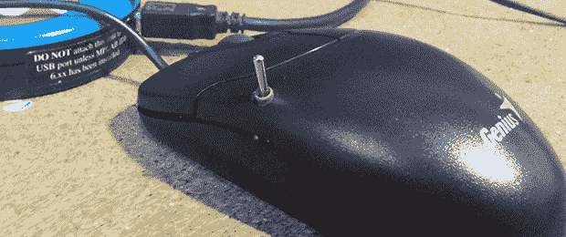

# 基于继电器的鼠标模拟器

> 原文：<https://hackaday.com/2014/06/15/the-relay-based-mouse-emulator/>

[谢妮]的工作包括使用一些测试软件，需要移动鼠标，点击几个按钮，检查一切是否正常，并一遍又一遍地重复这个过程。对于一些键盘宏来说，这显然是一个解决方案，但是出于一种残忍的恶意，测试软件需要有人在屏幕上移动鼠标。[谢妮]要做什么？做一个鼠标模拟器，当然是自动化整个过程。

谢妮称这种装置为 Memulator，是一系列提高测试效率的装置中最新的一种。第一个版本[是鼠标肿瘤](http://electronicmercenary.wordpress.com/2013/12/25/mouse-tumor/)，这是一个看起来很奇怪的设备，它只是关闭了光电鼠标的 LED，让光标保持在一个点上，而【谢妮】则反复敲击按钮。[第二个版本](http://electronicmercenary.wordpress.com/2014/02/18/memulator/)更先进，能够在屏幕上移动光标，完全不需要做任何 USB 编程:【谢妮】只是简单地使用一个电阻触摸板，一些继电器和几个罐子来将按钮转换成光标的移动。这是一个如此简单的解决方案，几乎让人觉得是错误的。

尽管如此，这里还是有一些有趣的技术。出于某种原因，[谢妮]在这个建筑中有一些旧的，罐状的苏联时代的继电器。虽然在如此有用和高效的构建中使用如此酷、如此棒的旧组件看起来很奇怪，但如果你试图修复如此明显损坏的古老软件，你还不如全力以赴，构建一些让 20 年后的人挠头的东西。

下面是 Memulator 的垂直视频。

[https://www.youtube.com/embed/bXHZWDY9uiw?version=3&rel=1&showsearch=0&showinfo=1&iv_load_policy=1&fs=1&hl=en-US&autohide=2&wmode=transparent](https://www.youtube.com/embed/bXHZWDY9uiw?version=3&rel=1&showsearch=0&showinfo=1&iv_load_policy=1&fs=1&hl=en-US&autohide=2&wmode=transparent)