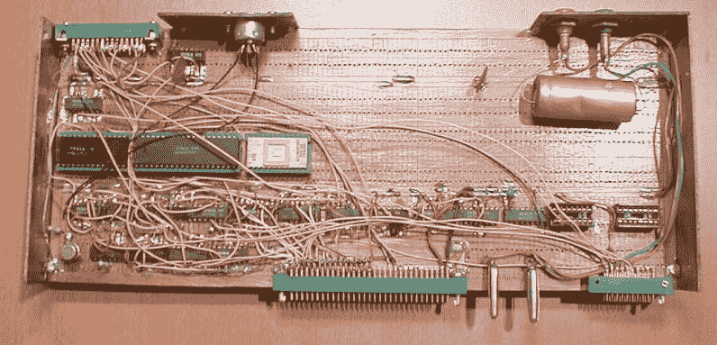
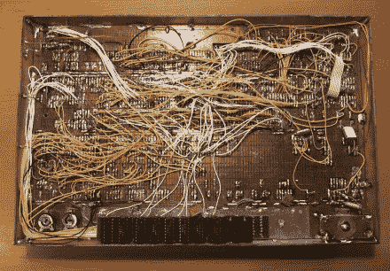
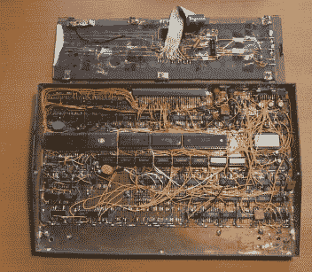

# RUM 80–从零开始构建的家用 Brew Z80 计算机

> 原文：<https://hackaday.com/2015/04/15/the-rum-80-a-home-brew-z80-computer-built-from-scratch/>

[M]最近向我们透露了来自捷克共和国的黑客[Lumir Vanek]的消息。在 1985 年到 1989 年间，[Lumir]建立了他自己的基于 Z80 的电脑。20 世纪 80 年代可用的家用电脑种类繁多。那些生活在西欧和美洲的人可以从 Acorn、Apple、Commodore、Atari、Radio Shack 和 Sinclair Research 等公司选择产品。甚至前捷克斯洛伐克也有来自[迪达蒂克](http://en.wikipedia.org/wiki/Didaktik)和[特斯拉](http://en.wikipedia.org/wiki/Tesla_(company))的家用电脑。

[Lumir]的构建基于 Z80 处理器，使用常规双面原型板构建。它具有 8 位 Z80 处理器 CPU、8kB EPROM(带监视器和基本)、两个 Z80 CTC 定时器、用于键盘和外部连接器的 8255 并行接口、64kB DRAM 和连接到电视的黑白 40×25 字符视频输出。外壳完全由覆铜层压板制成。[Lumir]记录了原理图，但没有电路板布局——因为整个系统是离散布线的。他甚至建造了薄膜键盘——将其描述为“多层铜纤维、树胶、带有彩色按键的纸张和透明薄膜”。当他用完主板上的空间时，他构建了一个扩展板。它有一个用于盒式磁带的 8251 串行接口、一个 8 位 D/A 转换器和一个连接到“一针”BT100 打印机的 8255 并行端口。

在软件方面，他编写了自己的[监控程序](http://www.valachnet.cz/lvanek/diy/old_story/monit.txt)，允许简单的交互，如显示和修改寄存器、内存、I/O 端口以及运行程序。他参考 Z80 指令集帮助从头开始写这个。后来他添加了一个 CP/M 仿真器。由于 Z80 有两个寄存器，一个用于用户交互，而另一个用于后台打印。最终，他甚至设法将[基本](http://www.valachnet.cz/lvanek/diy/old_story/basic.txt)移植到他的系统中。

查看[Martin mal]的精彩文章[铁幕后的家用电脑](http://hackaday.com/2014/12/15/home-computers-behind-the-iron-curtain/)以及关于铁幕后的[外设](http://hackaday.com/2015/04/13/peripherals-behind-the-iron-curtain/#more-152281)的后续文章，您可以从中了解更多关于“one pin”Bt 100 打印机的信息。

     