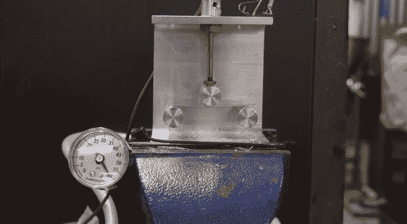

# 强化玻璃的科学

> 原文：<https://hackaday.com/2014/08/10/the-science-of-strengthening-glass/>

[本·克拉斯诺]又来了。这次他在解释一种简单的方法来强化玻璃。像往常一样，他首先演示和解释问题，然后提出解决方案，做得非常出色。

[Ben]首先使用一个简单的装置对一个玻璃显微镜载玻片施加一个可控的力。他的实验表明，一旦大约 30 磅/平方英寸的力施加到载玻片的中心，载玻片就会破碎。

[Ben]接着解释说，目前生产玻璃的方法会在玻璃中留下许多微小的杂质或裂纹。当载玻片弯曲时，内侧边缘受到压力，而外侧边缘受到张力。玻璃更容易承受压力。紧张是事情开始破裂的地方。张力最终导致这些微小的杂质扩散，导致玻璃破碎。

解决这个问题的一个可能的方法是找到一种方法来填充那些微小的杂质。根据[Ben]的说法，大多数玻璃都添加了钠以降低熔化温度。[Ben]解释说，如果你可以用更大的原子取代这些更小的钠原子，你就可以基本上“填充”玻璃中的许多微小杂质。

[本]通过加热一小桶硝酸钾自己做到这一点。一旦粉末熔化，他将载玻片浸入溶液中几个小时。在此期间，由于扩散的自然过程，一些钠原子被钾原子取代。

一旦载玻片冷却下来，[本]证明它们变得更加坚固。当放在测试设备中时，直到压力达到 60 磅/平方英寸到 70 磅/平方英寸之间，强度较大的滑块不会破裂。这是原来玻璃的两倍。如此简单的过程所带来的额外优势。一定要看下面的完整视频。

[https://www.youtube.com/embed/y02AXdec1sE?version=3&rel=1&showsearch=0&showinfo=1&iv_load_policy=1&fs=1&hl=en-US&autohide=2&wmode=transparent](https://www.youtube.com/embed/y02AXdec1sE?version=3&rel=1&showsearch=0&showinfo=1&iv_load_policy=1&fs=1&hl=en-US&autohide=2&wmode=transparent)