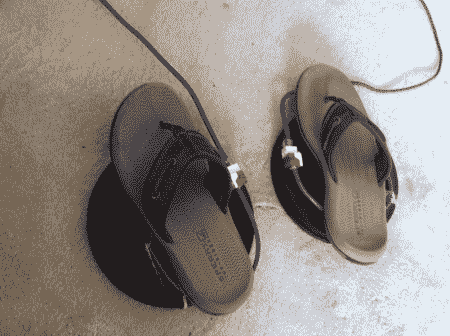

# 拟像，虚拟现实中行走的创新解决方案

> 原文：<https://hackaday.com/2012/08/31/the-simulacrum-an-innovative-solution-to-walking-in-virtual-reality/>

如果你一直在关注沉浸式游戏，即使是不经意地，你可能已经考虑过在游戏中尝试舒适可信的“行走”的困难。人们首先想到的通常是全方位跑步机，或 ODT。这有很多问题，其中一个最大的问题就是成本。它们非常贵。

MTBS3d 论坛的[Zalo]一直在研究他自己的[非常经济高效的解决方案，称为“拟像”](http://www.mtbs3d.com/phpBB/viewtopic.php?f=138&t=15191)。他以不到 100 美元的价格制作了这个游戏，它允许将行走动作转化到游戏中。正如你在下面的视频中所看到的，它工作得相当好，即使当一个是出于维修委员会(因此跛行)。

[https://www.youtube.com/embed/V7-ct2xCtBc?version=3&rel=1&showsearch=0&showinfo=1&iv_load_policy=1&fs=1&hl=en-US&autohide=2&wmode=transparent](https://www.youtube.com/embed/V7-ct2xCtBc?version=3&rel=1&showsearch=0&showinfo=1&iv_load_policy=1&fs=1&hl=en-US&autohide=2&wmode=transparent)

如您所见，每次抬脚都会向控制台发送一个信号，使其在指定的时间间隔内向前移动。光是这一点就很容易复制，但是他又进一步考虑到自然转动。每个垫子实际上能够绕着它的垂直轴旋转，让你自然地旋转你的脚。当你抬起脚时，脚垫会弹回向前，这样当你的虚拟身体转动时，你的真实身体会保持向前的方向。

对于一个复杂的问题，这确实是一个有趣且相当简单的解决方案，即使它并不完美。在帖子的某个地方，[Zalo]提到他提出了这个想法，因为他一直在使用“向前提升”的方法意外地走下悬崖。希望他会重新捡起来，想出一个解决办法。

我们将密切关注这一点以及其他一些想法[，期待我们的 Oculus Rift](http://hackaday.com/2012/08/17/were-getting-an-oculus-rift-dev-kit/) 。