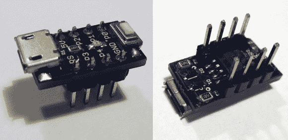

# 最小的基于 85 的 USB 板

> 原文：<https://hackaday.com/2014/05/07/the-smallest-attiny85-based-usb-board/>

“可能是最小的 ATtiny85 基‘杜伊诺导数’”。确实！当 Olimex 宣布 Olimexino 85s 是有史以来最小的 Arduino 时，[Tim]认为这是一个挑战。他的[非常小的基于 Arduino 的 USB 开发板](http://cpldcpu.wordpress.com/2014/04/25/the-nanite-85/)比[的 Olimexino](http://olimex.wordpress.com/2014/02/21/new-product-in-stock-worlds-smallest-arduino-ever-16-9-x-12-7-mm/) 要小很多！

Nanite 85 经过精心设计，既小巧又实用。它不仅比 Olimexino 小 20%,而且还有一个复位按钮！这种设计最酷的一个方面是它与 DIP [ATtiny85](http://www.atmel.com/devices/attiny85.aspx) 具有相同的引脚排列和尺寸。这意味着你可以使用 Nanite 85 通过 [USB 引导程序](https://github.com/micronucleus/micronucleus)开发你的代码，然后你可以直接用一个标准的(预编程的)ATtiny85 替换它。与上述器件相比，使用这种器件的主要缺点是，它不包括通过 USB(或电池)为器件供电的稳压器，器件只是从 USB 连接器直接连接到 5V 供电轨。

我们不禁对这个经过深思熟虑的设计印象深刻。它还易于组装，因为它使用较大的表面贴装元件。如果使用更小的元件，甚至可以包括更多的特征(例如调节器)。你有更小的 USB Arduino 吗？史上最小的 Arduino 比赛开始了！