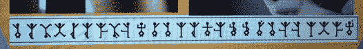

# 十周年代码的解决方案

> 原文：<https://hackaday.com/2014/10/27/the-solution-to-the-10th-anniversary-code/>

几周前，[1o57]，又名[Ryan Clarke]在我们的 10 周年派对上做了一个关于谜题、DEFCON 以及将密码谜题变成一种艺术形式[的演讲。曾经的魔术师，[1057]在他的演讲中加入了一个密码挑战，在我们的小聚会几天后，还没有人解开这个谜题。终于，](http://hackaday.com/2014/10/06/hackaday-10th-anniversary-1o57-and-the-art-of-encryption/)[有人费心坐下来搞清楚了](http://blog.tahnok.me/solution-to-losts-hackaday-challenge)。我们不知道[tahnok]赢了什么，但正如[1o57]所说，解决它就是它自己的奖励。

演示中的一些幻灯片有几个人物无缘无故地坐在旁边。[塔诺克]把这些放在一起，想出了:

doxiyldcyvdkinkumkrydnbygonymnxoc

在这种情况下，你可以试试[凯撒密码](http://en.wikipedia.org/wiki/Caesar_cipher)，或者只是将字符向左或向右移动一定的位置。因为[1o57]注意到这是*第十个*黑客日，所以[塔诺克]首先尝试了:

tenyobtsoltayadakcahotdrowdocdnes

看起来不太像，但那只是因为弦是反的。狡猾，狡猾。棘手。有了向电子邮件地址发送代码字的指令，[塔诺克]现在需要找到一个代码字。推特上有一张图片[1057]仍然是这个谜题的未解部分:

不知道这些小棍子是什么，他在谷歌上搜索“棍子代码”和“旗语”的变体，直到他偶然发现了[夏洛克·福尔摩斯](https://en.wikipedia.org/wiki/The_Adventure_of_the_Dancing_Men)的故事，*跳舞男人的冒险。*这是一个简单的替代密码，翻译过来就是“代码字心理密码”

这就是整个谜题。据我们所知，这花了大约一个月的时间来解决，与 DEFCON 挑战相比，相当简单。[1o57]可能会在评论中插话，告诉大家有多少人发现了线索并发送了电子邮件。