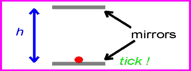
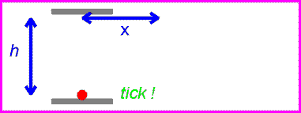
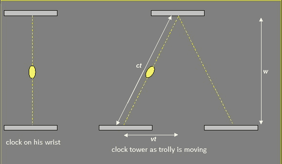
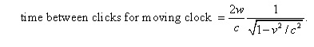

# 电磁辐射的怪异性质

> 原文：<https://hackaday.com/2014/09/17/the-spooky-nature-of-electromagnetic-radiation/>

我们的故事开始于一百多年前的瑞士伯尔尼，一个年轻的专利职员去工作了。他每天乘坐电车，每天都会经过一座不起眼的钟楼。但是今天是不同的，它是特别的。因为今天他会向自己提出一个问题——这个问题的答案将会提出一个迷人的难题。

不管他的电车是停下来了，还是正加速驶离钟楼，钟的指针似乎都走得一样快。他知道使他能看到时钟的电磁辐射以有限的速度传播。他还知道，与他的电车的速度相比，光速是惊人的。如此之大，以至于不管他是静止的还是运动的，他看到时钟的指针移动的方式都不会有任何明显的不同。但是如果他的手推车以时钟反射光的速度移动呢？时钟的指针如何移动？事实上，他们不能。或者如果他们有，他不会出现。就好像时钟的所有指针都停止了运动——在一瞬间凝固了。但是，如果他看看口袋里的手表的指针，它们似乎会正常移动。一个人如何解释钟楼的时间和他手表的时间之间的差别？哪一个是正确的？

他没有办法知道，要花三年时间才能回答这个问题。他不可能知道答案最终会导致发现物质和能量是同一个东西。没有办法知道他，这个未充分就业的专利办事员做一个简单的观察，将很快发现一个最大的谜团的答案，这个谜团困扰了他之前的每一个人——时间本身的本质。

爱因斯坦可能花了几年时间才得出我们现在所知的狭义相对论的答案，但他几乎肯定只用了几天时间就意识到艾萨克·牛顿…

肯定是错的。

爱因斯坦以他的“思想实验”而闻名——其中之一就是[光钟](http://galileoandeinstein.physics.virginia.edu/more_stuff/flashlets/lightclock.swf)。让上面的动画^(T3 1代表他的怀表。想象中的时钟由两个镜子组成，一束光在它们之间反射。重复模式代表一个基本时钟，其时间可通过下式计算:)

t = 2h/℃

其中 h =反射镜之间的距离，c =光脉冲的速度，T =时间。

重要的是要注意，无论他的手推车是在移动还是静止，这都是灯钟在他看来的样子。他和时钟都被认为是在同一个[参考系](https://www.princeton.edu/~achaney/tmve/wiki100k/docs/Inertial_frame_of_reference.html)中。

让 ^([1](#source1)) 上方的动画图像代表他的电车飞驰而去时的钟楼。一旦电车开始移动，他和钟楼现在被认为是在不同的参照系。要在这个时钟上计算时间需要一些基本的代数和几何知识 ^([2](#source2)) 。

如果我们设定时间等于距离除以速度，那么我们可以利用勾股定理，得到:

∞以上

然后，

t(c–v)= w

然后，

t(1–v/c)= w/c

然后对两边求平方根，并将脉冲的第二部分(直角三角形的对边，或(w))加倍，得到:

根据这个等式，移动时钟的滴答之间的时间将随着速度(v)的增加而增加。或者更简单地说——对于移动的物体来说，时间运行得更慢。注意当(v)等于零时会发生什么。该等式与我们最初的 T = 2h/c 相同。现在请注意，当(v)等于或大于(c)时会发生什么。方程变得不确定。因此，电车的速度不能超过或等于光速(c)。这包括所有有质量的东西，甚至包括重力本身。

如果你继续跟着这只兔子，你会发现光速，以及所有的电磁辐射，对于所有的参照系都是一样的。这是违反直觉的，但被证明是正确的。继续往前走，你会发现人类历史上最深刻的启示之一——E = MC²。

下次你用激光和无线模块进行黑客攻击时，请记住这些简洁的小事实，以及管理它们的法律的怪异性质。

【来源 1: *[时间膨胀](http://www.zamandayolculuk.com/cetinbal/htmldosya1/TimeDilation.htm)* 旅游资源中心】

【来源二: *[狭义相对论:几点了？](http://galileoandeinstein.physics.virginia.edu/lectures/srelwhat.html)* 迈克尔·福勒，弗吉尼亚大学物理系。]