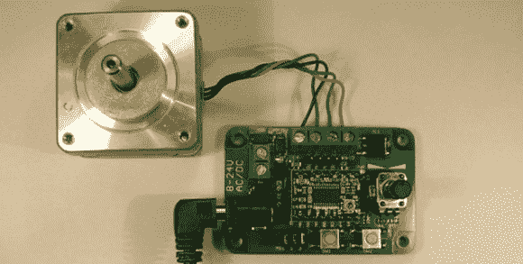

# 步进驱动器驱动器

> 原文：<https://hackaday.com/2014/03/02/the-stepper-driver-driver/>

Stepstick 和 Pololu 电机驱动器几乎是所有 Reprap 电子板的核心，但它们可能会变坏。测试这些东西的通常方法是在试验板上安装一个微控制器，拿一些电缆，然后接线。[【肯】的简易步进电机控制器](https://labitat.dk/wiki/Easy_Stepper_Motor_Controller)是测试这些驱动器问题的一个简单得多的解决方案，经过一点实践，可以在单面自制 PCB 上构建。

Easy 步进电机控制器是一个非常简单的板，与电机、电源和单个 Pololu 或 Stepstick 电机驱动器的接头连接。两个按钮和一个锅在 ATtiny10 的帮助下控制电机的旋转，高达 16 倍微步的跳线就在板上。

休息之后有一个视频展示了这个步进电机驱动器可以做什么。虽然不多，但是如果你只是在测试一个车手，这就足够了。
 [https://www.youtube.com/embed/F_W8n2Q1Aro?version=3&rel=1&showsearch=0&showinfo=1&iv_load_policy=1&fs=1&hl=en-US&autohide=2&wmode=transparent](https://www.youtube.com/embed/F_W8n2Q1Aro?version=3&rel=1&showsearch=0&showinfo=1&iv_load_policy=1&fs=1&hl=en-US&autohide=2&wmode=transparent)