# 史上最小的雅达利 2600

> 原文：<https://hackaday.com/2012/04/07/the-teensiest-atari-2600-ever/>

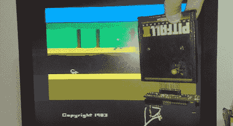

[达布里奥]送来一个他做的很棒的控制台模型。它可能只是[有史以来最小的雅达利 2600】(葡萄牙语，这里是](http://dabliogames.blogspot.com.br/2011/09/atari-mm-o-menor-atari-do-mundo-e.html)[谷歌翻译](http://translate.google.com/translate?hl=en&sl=pt&tl=en&u=http%3A%2F%2Fdabliogames.blogspot.com.br%2F2011%2F09%2Fatari-mm-o-menor-atari-do-mundo-e.html))。

构建从 Dynacom MegaBoy 开始，该公司生产了许多不合法的 2600 克隆体。MegaBoy PCB 是一种简约的[练习](http://hackaday.com/wp-content/uploads/2012/04/2600mm0045.jpg)，仅由一个集成电路、一个晶体、一些电阻和电容组成。[达布里奥]根据他逆向工程的[原理图](http://hackaday.com/wp-content/uploads/2012/04/megaboylight.jpg)做了一个新的 PCB 板[这个东西很小](http://hackaday.com/wp-content/uploads/2012/04/2600mm0027.jpg)。它比最小的[【本·赫克】2600 控制台](http://benheck.com/05-11-2007/vcsp-rev-51s-starting-to-roll-off-the-line)还要小得多。

[达布里奥]现在需要一个箱子来装他的新游戏机。他原本计划将整个东西安装在一个雅达利控制器中，就像这个商业产品一样。机缘巧合之下，他意识到整个系统(没有墨盒端口)装在一个 m&m mini 的塑料管里。

目前，[Dablio]在他的“Atari m & ms 显像管”上有两个端口——最大的是墨盒插槽，一个小的 VGA 端口位于显像管的盖子上。该 VGA 端口承载进出控制台的电源、控制器、声音和视频信号。

休息过后，他发来了一堆他的照片，这些照片在画廊里。现在是百万美元的问题:有人知道在哪里可以买到这些 Dynacom 超级男孩吗？

[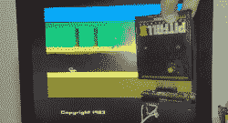](https://hackaday.com/wp-content/uploads/2012/04/atari.jpg)[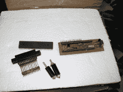](https://hackaday.com/wp-content/uploads/2012/04/2600mm0019.jpg)[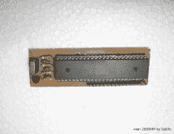](https://hackaday.com/wp-content/uploads/2012/04/2600mm0021.jpg)[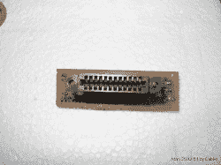](https://hackaday.com/wp-content/uploads/2012/04/2600mm0022.jpg)[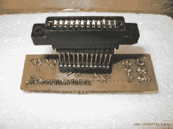](https://hackaday.com/wp-content/uploads/2012/04/2600mm0023.jpg)[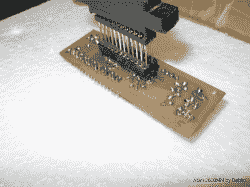](https://hackaday.com/wp-content/uploads/2012/04/2600mm0024.jpg)[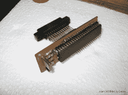](https://hackaday.com/wp-content/uploads/2012/04/2600mm0025.jpg)[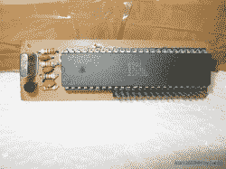](https://hackaday.com/wp-content/uploads/2012/04/2600mm0026.jpg)[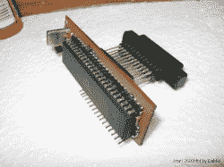](https://hackaday.com/wp-content/uploads/2012/04/2600mm0027.jpg)[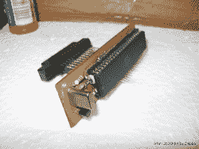](https://hackaday.com/wp-content/uploads/2012/04/2600mm0028.jpg)[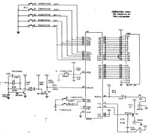](https://hackaday.com/wp-content/uploads/2012/04/megaboylight.jpg)