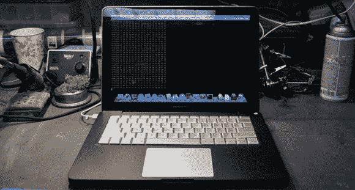

# 维修 MacBook 的尝试

> 原文：<https://hackaday.com/2013/06/27/the-trials-of-repairing-a-macbook/>

为了帮朋友的忙，[Phil]用一体式 MacBook 主板换了一个耳机插孔坏了、键盘控制器坏了、风扇坏了的主板。他不是一个让坏硬件浪费的人，他开始通过在任何可能的地方清理零件来修复这台现在坏掉的笔记本电脑。整个过程以结束，并在此过程中展示了令人印象深刻的焊接技巧。

键盘移植的第一步是在新的一体式 MacBook 上切一个大小合适的孔，用于旧的一体式 MacBook Pro 17”键盘。这是通过切割前一体式机箱的键盘面板，并非常小心地用环氧树脂将其粘合到一体式机箱中完成的。MBP 有一个单独的键盘和触控板控制器，所以当然[保罗]需要在机箱内为这些新的电子设备找到一些空间。这个空间是在内部硬盘旁边找到的，大量的热胶水将所有东西粘在了一起。

在未来，[Phil]计划增加更多的 led、3.5 毫米插孔和 USB 到 TTL 转换器——这是任何真正的“黑客”笔记本电脑的必需品。它仍然是一件很棒的作品，并且需要惊人的努力和技巧才能达到今天的水平。