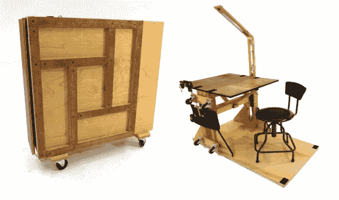

# 折叠起来的终极工作站

> 原文：<https://hackaday.com/2014/04/13/the-ultimate-workstation-that-folds-up/>

寻找一种简单的方法，即使你住在狭小的宿舍里也能继续制作东西？[Matt Silver]厌倦了没有专用的工作空间，所以他花了一些时间来设计这种模块化、可重新配置和可折叠的便携式工作站，几乎可以满足任何需求。

他开始画草图，在 SketchUp 中摆弄 3D 模型，最终通过反复试验建立了几个原型——他得出的结果令人印象深刻。它可以折叠成不到一英尺宽、三英尺见方的形状，并且有脚轮可以滚动。展开后，你可以将椅子放在其中一面可以折叠的墙上，使它保持稳定，桌子本身也可以根据不同的工作表面进行重新配置。他还配备了一个电源条、一个 LED 工作灯，甚至在侧面还有工具存放架。

这是一个非常全面的指导，绝对值得一读——尤其是看看它是如何神奇地展开的！如果你想知道建造它要花多少钱，你可能会看到 200 美元左右，这取决于你手头已经有的东西。我们真正喜欢的是它几乎完全由一块 4 英尺 8 英尺的胶合板制成——就像这个人在宜家工作一样！