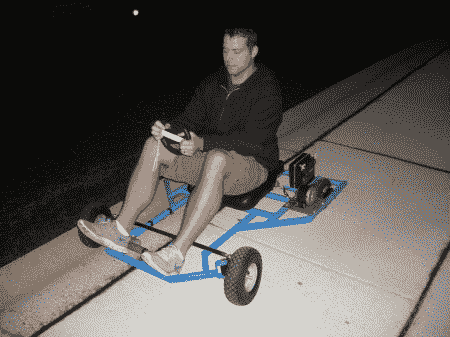

# 无线卡丁车

> 原文：<https://hackaday.com/2012/05/11/the-wiikart-a-wireless-go-kart/>

哎呀…看起来[我们已经讨论过这个了](http://hackaday.com/2011/10/29/wii-remote-controling-the-vehicle-youre-riding-in/)。我的错误。

如果这个名字没有给你提示，这个有趣的小卡丁车的灵感来自 MarioKart。目标是[建造一辆可以通过任天堂 Wiimote](http://aidanscollegefund.com/) 控制的功能性卡丁车。他们做得相当好，而且保持得相当简单。他们设计了一个框架，模糊地模仿游戏中手推车的形状。转向由一个 4”冲程线性致动器控制。这最初是直接挂在拉杆上的，但他们发现它太慢了。他们的解决方案是在两者之间放一个 1 比 3 的杠杆。这使得一切都变得更快。

虽然他们能够在硬件中对电机实施 PWM，但由于控制器的按钮性质，他们选择坚持全开、全关。连接和通信是由 Arduino 处理的，他们没有提到他们使用什么蓝牙模块。

你可以在下面的视频中看到，它的反应相当灵敏，有足够的动力在一些不同的地形上拖动乘客。

[https://www.youtube.com/embed/BH04PnpoZP0?version=3&rel=1&showsearch=0&showinfo=1&iv_load_policy=1&fs=1&hl=en-US&autohide=2&wmode=transparent](https://www.youtube.com/embed/BH04PnpoZP0?version=3&rel=1&showsearch=0&showinfo=1&iv_load_policy=1&fs=1&hl=en-US&autohide=2&wmode=transparent)