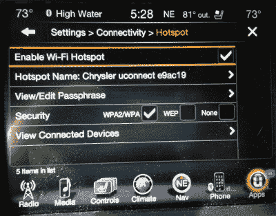

# 汽车黑客之年

> 原文：<https://hackaday.com/2015/09/01/the-year-of-the-car-hacks/>

随着夏季大型安全会议的结束，现在是回顾汽车安全的好时机。随着人们谈论对克莱斯勒、通用汽车和特斯拉的攻击，以及 DEF CON 上一个全新的汽车黑客村，人们越来越清楚，autosec 是一个不会消失的主题。

直到今年，autosec 的主题一直是车载网络。这是控制器之间的连接，控制你的引擎，推动你的防抱死刹车，启动你的安全气囊，播放你的音乐。在大多数车辆中，它们通过一种称为控制器局域网(CAN)的协议进行通信。

早在 2010 年，[汽车嵌入式系统安全中心](http://www.autosec.org/index.html)就发表了一篇关于这项研究的早期论文。他们展示了一些可以通过物理访问车辆网络来利用的漏洞。

许多关于车载网络安全的讲座揭示了一个共同的主题:访问内部网络可以控制车辆。我们甚至在 Hackaday 上有一个关于它的[系列。](http://hackaday.com/tag/can-hacking/)

汽车行业的反应是集体“是的，我们已经知道了。”这些网络从未被设计为安全的，而是专注于在控制器之间提供可靠的实时数据传输。由于数据传输是主要的设计目标，不可避免的会有一些有趣的漏洞。

## 信息娱乐和远程信息处理

汽车公司正在努力集成新功能，以区分他们的产品并创造新的收入来源。想要礼宾服务吗？你可以买通用的安吉星。需要车内 WiFi 热点？克莱斯勒在 uConnect 中内置了这一功能，每月收费 35 美元。想要通过触摸屏控制车辆的各个方面吗？也许特斯拉 Model S 适合你。

The Jeep Cherokee’s WiFi dashboard

有两个主要特征导致了更多的互联车辆:信息娱乐和远程信息处理。信息娱乐系统是车载电脑，可以让你播放音乐、获取车辆信息、导航等等。远程信息处理系统向第三方提供车辆数据，用于安全、诊断和管理。

为了提供这些功能，控制器之间的连接是必要的。例如，OnStar 需要知道你的安全气囊何时展开，以便寻求帮助。因此，它与安全气囊控制器联网。

监管机构正在帮助加快这一进程。由于 eCall 倡议，2018 年后在欧洲销售的所有新车都必须在发生事故时提供语音通信和“最低数据集”。这意味着法律将要求车辆具有蜂窝连接，支持语音和数据。

随着车辆连接到无线电，车载网络的远程桥被创建。访问车载网络需要物理访问车辆的假设不再成立。

## “空气间隙”

克莱斯勒黑客利用了一个任何熟悉网络安全的人都会认为微不足道的漏洞:运行不安全服务的开放端口。如果你想知道黑客攻击的细节，[克里斯]和[查理]发表了一篇详细的论文，绝对值得一读。

该漏洞的症结在于克莱斯勒的一个假设。他们的远程信息处理单元有两个处理器，一个连接到车载网络，一个连接到互联网。假设这些设备之间的空气间隙阻止了对车载网络的远程访问。

不幸的是，它们的气隙是由铜制成的。这是两个处理器之间的 SPI 连接，允许执行各种命令，包括固件更新。随着流氓固件在车载网络上运行，我们又回到了五年前车载网络不安全的问题上。

我有机会在 DEF CON 上与克莱斯勒的一些人交谈，他们继续称之为“气隙系统”。事实是，我们永远不会看到一辆新车在车载网络和蜂窝网络之间存在真正的差距。新的功能和法规要求这种级别的连接。

## 供应链

[克里斯]和[查理]决定专注于克莱斯勒吉普切诺基，但我们不要把所有的责任都推到克莱斯勒身上。运行易受攻击服务的 uConnect 设备实际上是由 Harman 制造的。哈曼是最大的汽车音响和信息娱乐系统制造商。你会在奥迪、宝马、路虎、奔驰、沃尔沃、别克等汽车上发现他们的设备。

这就是如今汽车行业的工作方式。像克莱斯勒这样的原始设备制造商整合了来自各种“一级”供应商的零件。一级供应商从“二级”供应商处采购零件。由克莱斯勒选择这些零件，然后将它们组装成一辆汽车。

当从一系列供应商处购买时，安全性是一个难题。作为一名工程师，您不得不集成根据一系列标准选择的部件，而安全性并不是购买决策的首要考虑因素。原始设备制造商并不总是有资源来评估他们购买的产品的安全性，而是依赖供应商来制造安全的产品。

供应商的另一个问题是修复进展缓慢。克莱斯勒无法自己解决这个问题，而是需要等待供应商来解决。补丁完成后，他们可能需要在发布之前对补丁进行测试和验证。这都需要时间。

## 下一步是什么？

在安全行业之外，人们多年来一直在黑客攻击汽车。调谐器收费的“芯片”汽车，以提高性能，消除限制，并改变设置。术语“碎片”来自于拆焊和更换旧 ECU 上的 EEPROM 芯片以改变校准值的过程。

这种类型的工作有良好的意图，人们支付修改他们的车辆。安全行业更关注邪恶的动机。我们已经看到一些黑客通过[攻击钥匙](http://hackaday.com/2012/07/07/keyless-bmw-cars-prove-to-be-very-easy-to-steal/)来偷车，但是这种类型的攻击仍然需要物理接触车辆。

想象一下:你的车启动了，并且不能离开停车场。信息娱乐显示屏上会出现一条消息，告诉您将比特币转移到指定地址以解锁车辆。你被汽车勒索软件盯上了。幸运的是，我们还没有看到这样的攻击，但随着问题的出现，这变得有可能了。

车辆也变得更加自动化。[高级驾驶辅助系统](https://en.wikipedia.org/wiki/Advanced_driver_assistance_systems) (ADAS)通过让计算机控制车辆的转向、油门和刹车来提高安全性。然而，这些系统也给受损系统带来了额外的威胁。

另一个问题是隐私。信息娱乐系统可以访问位置数据、麦克风和车辆信息。关于电子呼叫，欧盟表示“您是否担心自己的隐私？你不应该。”我们也许应该。好消息是人们正在努力保护司机。DEF CON 的新汽车黑客村由 [Parsons](http://www.parsons.com/Pages/default.aspx) 和 [CANBusHack](http://www.canbushack.com/blog/index.php) 经营，OEM 和一级供应商的员工表现强劲。汽车公司开始注意了。