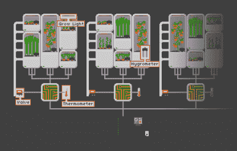

# 这些建筑在城市中种植食物

> 原文：<https://hackaday.com/2015/04/21/these-builds-grow-food-in-cities/>

你可能听说过“食物沙漠”这个术语:很难获得新鲜水果和蔬菜的地方。帮助缓解这个问题的一个方法是促进城市农业。本周，我们向你发出挑战，让你想出让在城市地区种植新鲜食物更容易、更有吸引力的主意。让我们来看看:

## 宜家模式:

本周主题中流行的一个概念是准备好——组装园艺工具。从个人经验来看，我认为这非常重要。很久以前，在一个很远很远的破公寓里，我和妻子在阳台上种西红柿。这些植物长得很茂盛，结出了果实，当它们还是绿色的时候，附近的松鼠群马上就把它们偷走了。第二年，我建造了这个产品笼子，我们可以享受我们的劳动成果了。但不是每个人都能在没有帮助的情况下迅速找到这样的解决方案。

Aker 是一套模块化农业系统的设计。这个想法是找到一个 hackerspace 或其他拥有 CNC 路由器的小组，并使用这些计划切割出不同的农业“家具”，如鸡笼、分层园艺容器架、墙花园、堆肥系统和蜂箱。如果需要的话，鸡笼设计可以作为笼中花园。

同样的还有[Eric's] [宜家风格的城市园艺](https://hackaday.io/project/5316-urban-gardening-ikea-style-kit)。他很高兴能把自己多年积累的知识传递下去。其中一部分是一个简单的园艺台，可以放置长方形的盆栽容器。

## 模块化温室:

接下来是模块化农业的概念。我们喜欢这样，因为花园可以根据可用空间进行缩放。

这里看到的是[模块化垂直农业](https://hackaday.io/project/5084-modular-vertical-farming)模型。该系统根据内部种植的作物为每个豆荚指定不同的尺寸和特征。该概念还包括一个监测和反馈系统，将帮助每个城市农民取得成功。

将模块化与节水相结合是 Hydropod 项目。这不是纯粹的水培法，但是垂直的圆柱体被设计用来将水抽到顶部，并在水从底部流出时回收。

我们不想在没有简要提及 HydroPI Garduino 的情况下继续讨论。标题中最大的嗡嗡声是值得称赞的。我们正在考虑加入一些常用工具来帮助监控这个水培花园。但是对于经常搬家的城市居民来说，便携式的强调是有价值的。

## 优步-保护:

这个想法很有趣。如果你生活在一个经常使用空调的环境中，冷凝器盘管从空气中去除的湿气很有可能会直接排入下水道。微灌项目希望通过封存水用于下一个城市花园灌溉周期来改变这种状况。我们希望看到每平方英尺建筑的平均冷凝水排放量的可靠数据。

## 本周的获胜者

本周第一名由[阿克尔](https://hackaday.io/project/5299-aker)获得，他将获得一个 [RGB 遮光套装](http://store.hackaday.com/products/rgb-shades-kit)。

**本周第二名**前往[模块化垂直农业](https://hackaday.io/project/5084-modular-vertical-farming)，将获得[古德菲特 42](http://store.hackaday.com/products/goodfet42) JTAG 程序员和调试器。

**本周第三名**前往[微灌用冷凝水捕捉](https://hackaday.io/project/4942-condensate-capture-for-micro-irrigation)，将获得 Hackaday [CRT 安卓 tee](http://store.hackaday.com/products/crt-head-tee) 。

## 下周的主题

我们正在转向一系列新的每周赠品，数量更多，价值更高。本周我们将颁发三十(30)份奖品。每个将是 50 美元的代码旋转一些多氯联苯。在我们下一个*时间的奖品*帖子中会有更多的细节。现在确保你提交一份正式的参赛作品。在 [Hackaday.io](http://hackaday.io) 上启动您的项目，并使用左侧图片下方的“提交”按钮提交该项目，以获得 2015 年 Hackaday 大奖。

* * *

#### 2015 年[黑客日奖](http://hackaday.io/prize)由以下机构赞助:

