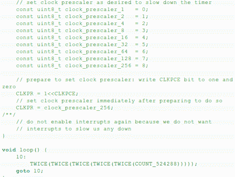

# 在 ide 之外思考制作一个快速计数的 Arduino

> 原文：<https://hackaday.com/2012/07/11/thinking-outside-the-ide-to-make-a-fast-counting-arduino/>

[Udo Klein]接受了使用 Arduino 板尽可能快地计数的挑战。这个任务包括寻找捷径，让他能够使用普通硬件尽可能快地驱动 20 位计数器。但是问题是 Arduino 环境在后台运行时会有一些开销，这会减慢速度。他仔细研究了每一个障碍，然后给出了一个绕过它们的方法。

代码使用了一个我们在现代 C 嵌入式编程中通常看不到的命令；goto 语句。他用这个来绕过 Arduino 内置的 loop()函数所使用的额外周期。在他被黑的循环中运行的唯一命令是一组深度嵌套的宏。他们使用 AVR 芯片内置的硬件 XOR 来切换输出引脚[。这是对寄存器的直接寻址，从而消除了 digitalWrite()函数带来的速度下降。](http://hackaday.com/2011/07/09/hardware-xor-for-output-pins-on-avr-microcontrollers/)

结果是一个软件计数器以大约 98.9%的硬件时钟速度切换输出灯(见休息后的剪辑)。令人印象深刻，但[Udo]认为他还可以再快一点。

[https://www.youtube.com/embed/CHlsdjbMFSQ?version=3&rel=1&showsearch=0&showinfo=1&iv_load_policy=1&fs=1&hl=en-US&autohide=2&wmode=transparent](https://www.youtube.com/embed/CHlsdjbMFSQ?version=3&rel=1&showsearch=0&showinfo=1&iv_load_policy=1&fs=1&hl=en-US&autohide=2&wmode=transparent)