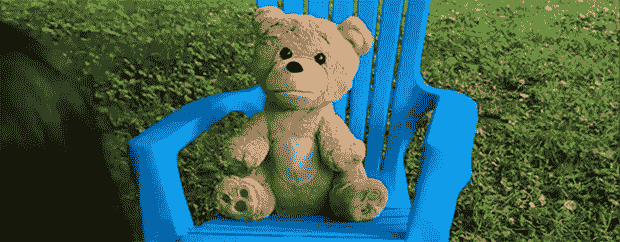

# 这只熊可以通过图灵测试

> 原文：<https://hackaday.com/2013/07/26/this-bear-can-pass-a-turing-test/>

一些人认为第一个人工智能的出现是一个意外，另一些人认为它是一台战争机器，决定了保护人类的唯一方式是将他们全部杀死。事实证明这两种观点都是错误的。第一个人工智能显然是一只泰迪熊，在 Kickstarter 上售价 60 美元。

Supertoy Kickstarter 正在出售一种机电一体化泰迪熊，它带有电机、扬声器和足够连接手机的电子设备。在插上你的手机并把它塞进泰迪的胸腔后，这只熊活了过来，拥有完全属于他自己的智能，声音似乎来自[彼得·格里芬]。

不用说，我们只是有点怀疑泰迪能否像 Kickstarter 视频中展示的那样表演。虽然泰迪背后的团队[之前已经成功开发了一个会说话的聊天机器人](https://play.google.com/store/apps/details?id=com.pannous.voice.actions.free&hl=en)，但这段视频让这项技术显得*太棒了。*就连声音听起来都像一个拿着麦克风的真人，而不像笨重的 GPS 个性。

请随意在评论中推测这项技术可能有多好。