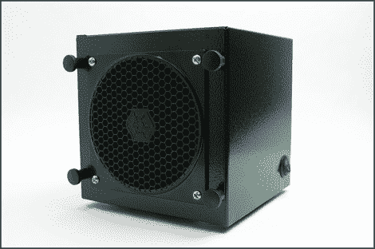

# 这个 Diy 抽油烟机将成为你工作台的展示品

> 原文：<https://hackaday.com/2012/09/25/this-diy-fume-extractor-will-be-a-showpiece-for-your-workbench/>

我们不知道这个 diy 抽油烟机的效果如何，但它看起来确实很棒！我们一直在想，是时候停止在项目工作时试图吹走焊料烟雾了，这可能正是我们需要的动力。6 英寸的立方体不会妨碍你的工作，因为它包括一个碳过滤器，应该可以将助焊剂燃烧的气味降到最低。

[Jeff]的项目基本上是将一个 120 毫米的 PC 冷却风扇和一个电源组合在一起。风扇安装在他从 Digikey 那里得到的钢制外壳内。随之而来的面板被修改，以接受风扇，以及随之而来的烧烤硬件。在组装之前，他用一些铁锈色的黑色喷漆涂在盒子上。这给了它一种纹理，可以隐藏应用程序中的任何瑕疵。

我们不太清楚它是如何被驱动的。听起来像是他在把电线插到电源上，但我们没有看到任何类型的调节器来给必须是 12V 直流风扇供电。有[构建指令可用](http://www.instructables.com/id/DIY-Fume-Extractor)，但它们并没有消除我们的困惑。