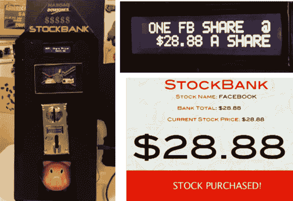

# 这个存钱罐是我们的股票经纪人

> 原文：<https://hackaday.com/2013/04/20/this-piggy-bank-is-our-stock-broker/>

[Johna 和 Justin]正在努力消除玩市场的情绪。他们建造了这个[存钱罐，当你的硬币总计一股的成本时，它会自动购买股票](http://stockbank.coin-operated.com)。没错，只需将选择器转到你选择的三只股票之一(本例中使用了谷歌、脸书和苹果)，并插入一些硬币。银行清点你的钱，与当前在线股票价格进行比较，如果你有足够的钱，就扣动扳机。你可以在跳转之后查看一个演示剪辑。

由于 Adafruit 的可编程多硬币接收器，硬件相当简单。它处理现金，并且很容易与处理其余工作的 Arduino 接口。它通过 USB 连接到计算机，依靠 PHP 脚本来查询当前价格。我们稍微挖掘了一下代码库,但是没有找到实际购买股票的代码片段。不管他们是否真的实现了这一点，这肯定是一个有趣的概念。

[https://www.youtube.com/embed/Tupn_7OrPuA?version=3&rel=1&showsearch=0&showinfo=1&iv_load_policy=1&fs=1&hl=en-US&autohide=2&wmode=transparent](https://www.youtube.com/embed/Tupn_7OrPuA?version=3&rel=1&showsearch=0&showinfo=1&iv_load_policy=1&fs=1&hl=en-US&autohide=2&wmode=transparent)