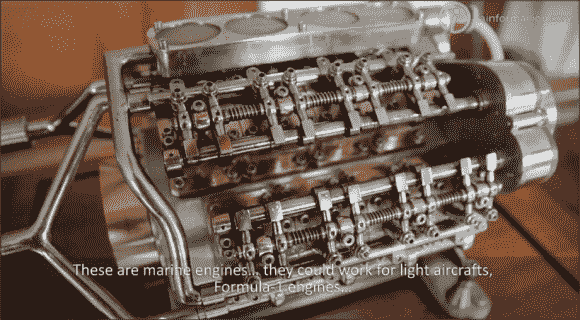

# 本周手工制作，黑客日

> 原文：<https://hackaday.com/2013/06/09/this-week-on-handmade-hackaday/>

本周《手工制作》节目中，我们看到了各种各样的技能。

*   有一个人手工制作微型发动机。
*   你可能会认出这些三重奏的结构。
*   在某人的地下室里从零开始建造的兰博基尼。
*   在中国街头用糖制作可食用的艺术品

HANDMADE.hackaday.com 发展迅速。继续发送那些好的提示！我们也有一些自己计划的视频，请密切关注！