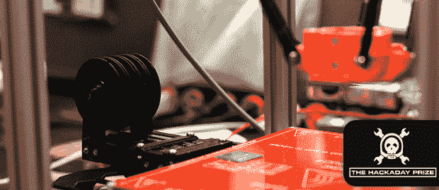

# THP 参赛作品:一台 300 美元的取放式 3D 打印机

> 原文：<https://hackaday.com/2014/06/04/thp-entry-a-300-pick-place-3d-printer/>

随着廉价 PCB 制造、(相对)易于使用的布局工具的出现，以及几乎所有可以想象的器件原型的出现，定制电路的时代即将到来。然而，制造这些定制电路的工具通常非常昂贵，或者除了最足智多谋的黑客之外，其他人根本无法获得。如果这个国家的每个车间都有一台取放机，那就太好了，而[300 美元的取放/ 3D 打印机](http://hackaday.io/project/963-%24300-Pick-and-Place-%2F-3D-printer)将是向世界各地数百万电子修理工介绍这项技术的绝佳方式。这也是进入 Hackaday 奖的绝佳机会。

这台机器的基本设计是一个三角洲机器人。这是一个比笛卡尔机器人更好的选择；deltas 更快，可以有更高的加速度，如果你想快速地把几块板拼在一起，这是一个很好的选择。虽然与其他 3D 打印机 delta 机器人相比，配置看起来有点颠倒，但这是有原因的:该设计是用进化算法和统计测试模拟的，以找到机器的最佳几何形状。整机应能放置 0201 元件；任何更小的东西都会被称为尘埃。

该软件符合所有要求，使用 OpenCV 进行图像处理，使用 ARM 板进行电机控制和计算任务，并使用大量机械和气动工作来吸取零件。他们甚至在研究 3D 打印的带式给料机。现在，在考虑拾放设备的总成本时，一个经常被忽略的部分基本上是免费的。

这是令人敬畏的工作，即使他们没有赢得 Hackaday 奖，这仍然是每个黑客空间应该拥有的东西。现在，如果有人愿意破解通孔电镀问题…

* * *

 **本帖介绍的项目是[黑客大奖](http://hackaday.io/prize)中的一个参赛项目。建造一些令人敬畏的东西，赢得太空之旅或数百个其他奖品。**