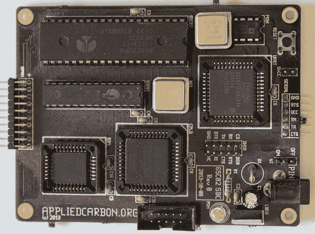

# THP 参赛作品:一个 6502 单板机机器人(在多块板上)

> 原文：<https://hackaday.com/2014/08/16/thp-entry-a-6502-sbc-robot-on-multiple-boards/>

机器人一直是学习电子学的一个很好的工具，但如果你将今天的机器人套件与 80 年代和 90 年代初的机器人套件进行比较，就会发现明显的差异。新电脑中有相当强大的微控制器，你用*语言*对它们编程，而不是直接的机器代码。鉴于这个社区倾向于说，“你可以用 555，”这显然是一个问题。

[Carbon]的 Hackaday 奖参赛作品[是对 Heathkit HERO 和机械臂的伟大复古回拨](https://hackaday.io/project/2216-6502sbc-Robot)，你现在可以在每个主要教育机构的电子实验室的架子上找到它们。这是一台 65C02 单板计算机，设计时考虑了机器人技术。

6502 板正是你所期望的；一个 CPU、RAM、ROM、CPLD 胶和一个串口。堆栈中的第二块板相当有趣—[它是一个完全由分立逻辑制成的双通道伺服板](https://hackaday.io/project/2216/log/6138-progress)。堆栈中的最后一块板是一个用于 Pololu 反射传感器的 8 通道 ADC，使这个位于 [Boe-bot 机箱](http://www.parallax.com/product/28132)中的 6502 成为一个合适的循线机器人，在 6502 汇编中编码。

下面是[Carbon]的机器人视频。

* * *

 **本帖介绍的项目是[黑客大奖](http://hackaday.io/prize)中的一个参赛项目。建造一些令人敬畏的东西，赢得太空之旅或数百个其他奖品。**

[https://www.youtube.com/embed/S5xz5AuFySE?version=3&rel=1&showsearch=0&showinfo=1&iv_load_policy=1&fs=1&hl=en-US&autohide=2&wmode=transparent](https://www.youtube.com/embed/S5xz5AuFySE?version=3&rel=1&showsearch=0&showinfo=1&iv_load_policy=1&fs=1&hl=en-US&autohide=2&wmode=transparent)