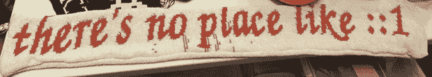

# THP 条目:所有的纱线都是美丽的

> 原文：<https://hackaday.com/2014/06/30/thp-entry-all-yarns-are-beautiful/>

有很多建筑将现代电子设备改造成古老的针织机。用纱线打印的能力非常酷，但当你看看这些项目的总成本——特别是古老的兄弟 KH-930 针织机——这些项目开始变得非常昂贵。对于这些 700 美元的针织机来说，一个更便宜的解决方案是兄弟 KH-910 型号，这是同类产品中的第一款，也是一台大约 100 美元就能买到的机器。[为了获得 Hackaday 奖](http://hackaday.io/project/1611-AYAB---all-yarns-are-beautiful)，[chris007]和[andz]将现代电子技术应用到这台功能稍逊的针织机中，将曾经的旧物改造成与更昂贵的机器功能相当的东西。

更昂贵的 KH-930 和-940 针织机是相当令人印象深刻的技术，由软驱控制，可以用串行电缆改装以上传图案。这是[电子针织](https://learn.adafruit.com/electroknit/overview)和[针织](http://www.knitic.com/)的基础，但它们根本无法与兄弟 KH-910 一起工作，这是一台装有原始扫描仪和半透明图片卡的机器。这就像穿孔卡和磁盘驱动器的区别，真的。

[chris]和[andz]为兄弟 KH-910 设计的新控制器是基于 Arduino 的，它充当了 PC 和针织机内 200 个螺线管和针之间的连接。这本身就令人印象深刻——现在，兄弟 KH-910 不再局限于 60 像素宽的纱线印花，而是可以使用其全部宽度，只受你的手臂力量和纱线数量的限制。

* * *

 **本帖介绍的项目是[黑客大奖](http://hackaday.io/prize)中的一个参赛项目。建造一些令人敬畏的东西，赢得太空之旅或数百个其他奖品。**

[https://player.vimeo.com/video/99023446](https://player.vimeo.com/video/99023446)