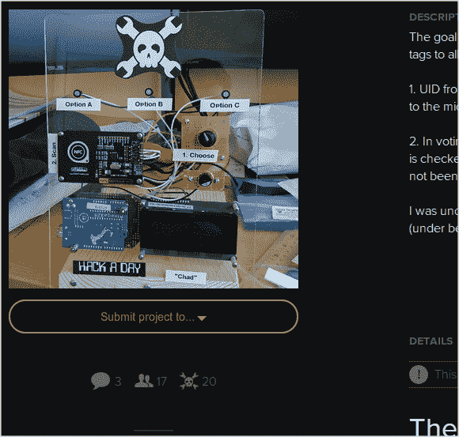

# 参赛很容易:Hackaday 奖

> 原文：<https://hackaday.com/2014/06/04/thp-entry-is-easy/>

[https://www.youtube.com/embed/L1N5oM4hmw8?version=3&rel=1&showsearch=0&showinfo=1&iv_load_policy=1&fs=1&hl=en-US&autohide=2&wmode=transparent](https://www.youtube.com/embed/L1N5oM4hmw8?version=3&rel=1&showsearch=0&showinfo=1&iv_load_policy=1&fs=1&hl=en-US&autohide=2&wmode=transparent)

没有提交 Hackaday 奖的参赛作品是一个很大的错误。你能做的最坏的事情是对开放硬件做出令人敬畏的贡献，但是你可以赢得一次太空之旅或数百个其他奖励。开始很简单:

1.  在 [Hackaday.io](http://hackaday.io/) 上注册一个帐户
2.  用标签 [#TheHackadayPrize](http://hackaday.io/projects/tag/TheHackadayPrize) 开始记录你的项目
3.  点按“将项目提交给…”按钮，使其正式化

不够简单？我们甚至做了一些截图来证明这有多简单。休息后请继续关注。

让它连接起来，让它开放，让它令人敬畏，你就能赢！

#### 让它成为一个正式条目

不要等到项目完成。如果你想在社区投票中为衬衫、贴纸、补丁等投票，你需要把它变成官方的。

Click the submit button on the left column of a project you have created.

Choose “Official Hackaday Prize Entry” from the drop-down box

Fill out the entry form and click “Submit my project” to officially enter your project