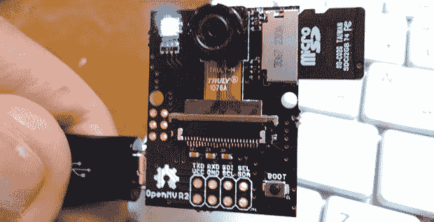

# THP 参赛作品:OpenMV

> 原文：<https://hackaday.com/2014/06/06/thp-entry-openmv/>

未来是一个可怕的地方，充满了机器人、无人机和带摄像头和视觉系统的智能设备，它们会跟随你的狗、你的孩子或你的脸，尽职尽责地记录他们看到的一切，向服务器报告，并汇编可以出售给营销公司的庞大数据集。我们并不热衷于这种对未来的看法，但是它背后的技术——在一切事物中的廉价摄像机——非常酷。[Ibrahim]正在为廉价相机时代的到来尽自己的一份力量，这种相机很容易与他参加 Hackaday 奖、[OpenMV](http://hackaday.io/project/1313-OpenMV)的作品相结合。

易于与微控制器和单板计算机接口的数码相机的想法并不新鲜。有[系列 JPEG 相机](https://www.sparkfun.com/products/retired/10061)和 [CMUcam5 Pixy](http://www.cmucam.org/projects/cmucam5/wiki) ，但它们的价格大约在 70 美元左右。这不是你可以用来设计产品的东西。[Ibrahim]的 OpenMV 价格约为 15 美元，并提供一些有趣的功能，如车载图像处理，大量的 RAM，甚至是无线扩展，这要归功于 TI 的 CC3000 WiFi 模块。

目前，OpenMV 能够以 25fps 的速度进行人脸检测，以高于 30fps 的速度进行颜色检测，这都要归功于以 180MHz 运行的 STM32F4 ARM 微处理器。板上支持高达 64MB 的 RAM，通过串行、SPI、I2C、USB 2.0 和 WiFi 提供 IO。

这本身是一个有趣的项目，但这个项目真正酷的是价格:如果[易卜拉欣]真的可以以 15 美元一个的价格生产这些东西，他手上就有一个实际的产品，可以很容易地塞进无人机或冰箱，用于你可以想象的任何酷或邪恶的目的。

* * *

 **本帖介绍的项目是[黑客大奖](http://hackaday.io/prize)中的一个参赛项目。建造一些令人敬畏的东西，赢得太空之旅或数百个其他奖品。**