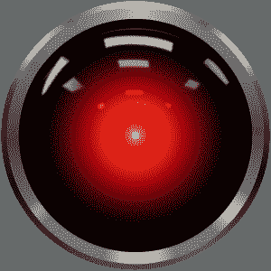

# THP 黑客传记:尼尔·詹森

> 原文：<https://hackaday.com/2014/10/02/thp-hacker-bio-neil-jansen/>

如果我们在几年前举办一场比赛，为建设最具创新性的开放硬件项目提供一次太空之旅，获胜者将不可避免地成为 3D 打印机。时代已经改变，3D 打印正在达到简单塑料挤出所能做到的极限，并且有新的硬件挑战需要征服。硬件设计师面临的挑战之一是快速创建和组装电子电路的能力。为此，有一些拾取和放置机器正在开发，成本最低的[是 FirePick Delta](http://hackaday.io/project/963-%24300-Pick-and-Place-%2F-3D-printer) 。它以 300 美元的拾放机自销，大量借鉴 RepRap 项目，使修理工和工程师能够快速组装 PCB。

[Neil Jansen]是 FirePick Delta 的项目负责人，与团队成员(从湾区的软件开发人员到电子技术人员和高中生)一起，他们创造了成本最低、功能最强的拾放机。该机器已经有带式送料器、盘式送料器、视觉系统和分配锡膏的模块。这是一个惊人的成就，如果不是因为运输中的一些损坏，我们会有一个[尼尔]在纽约 Maker Faire 演示火镐的视频。

取而代之的是，我们有一个关于[尼尔]的传记，以及他在建造火镐时所面临的挑战。您可以阅读下面的内容，或者查看他们的第二个演示视频以获得 Hackaday 奖:

[https://www.youtube.com/embed/46pLeLBYVTs?version=3&rel=1&showsearch=0&showinfo=1&iv_load_policy=1&fs=1&hl=en-US&autohide=2&wmode=transparent](https://www.youtube.com/embed/46pLeLBYVTs?version=3&rel=1&showsearch=0&showinfo=1&iv_load_policy=1&fs=1&hl=en-US&autohide=2&wmode=transparent)

机器人技术和极限电路板。世界还不承认极限赛道板是一项运动。但它基本上包括消耗大量的红牛，听大声的 Dubstep 和电子音乐，设计疯狂的电路，然后在电路板和零件到达后尽快建造它们。这是极端的，因为你必须在第一次修订时就把设计做好，不能返工。有点像黑客马拉松或者纹身墨水师真人秀。因为还没有人知道这项运动，所以我是 2014 年的非官方世界冠军。

航空航天、GPS / GNSS 接收器、无线电、自动驾驶仪、转发器和防撞系统等等……我的工作是对这些设备进行硬件/软件测试和验证。这些天我主要写软件，但在我的上一份工作中，在一个典型的日子里，我会在 SolidWorks 中做 CAD，原理图捕获和 pcb 布局，编写嵌入式代码，布线测试夹具和线束，需求捕获，以及许多其他东西。我只有高中学历，其他都是自学的。尽管这是一个很大很闷的公司，我仍然可以做很多不同的事情，这让我很开心。我们的其他团队成员也有白天的工作。Karl Lew 是加州湾区的一名全栈软件开发人员。Christian Lerche 是丹麦的一名电子技术员，在一个研究机车电子的实验室工作。代顿 Pid 是我们最年轻的成员，16 岁，正在读高中。托马斯·基尔布莱德在普渡大学上学。

我的激情基本上是通过客观主义、批判性思维和逻辑来追求现实，并传播这些理念，以身作则，按原则生活，欣赏生活的美，并对自己的行为负责。

最近，我的 2009 款 MacBook Unibody 差点就获得了这一荣誉。我一直用它作为我们 Hackaday 项目的主要开发平台，大部分时间都是在双引导进入 Windows 7 的情况下。它非常慢，有时需要几分钟才能在不同的应用程序之间切换。它的最大内存是 4GB，当然，每次我需要双启动回 OSX 做照片编辑或什么的，这是浪费时间。电池已经没电快两年了，所以它基本上是固定在桌子上的。我几乎要把它拿出来，破坏它的办公风格，同时播放 iTunes 上 Geto Boys 的必录“Still ”,直到它不再播放为止。但相反，我用我四处乱放的零件组装了一台新电脑，一个新的主板、CPU 和 16 GB 内存。自从我搞定 HaD 项目后，我的工作效率大概提高了两倍。

我在很大程度上是 OS 不可知论者。在一个典型的日子里，我使用 Windows、OS X、BSD、Linux(桌面和嵌入式)，偶尔也使用深奥的 RTOS 平台。我被迫为 CAD 运行 Windows，但这是我最不喜欢的编程方式，我也最不赞同它。我用我的 MacBook 进行视频编辑、音频编辑、photoshopping 和其他图形或 A/V 类型的东西。Linux 对于嵌入式和服务器应用程序来说很棒，但我不能在上面运行 Cubify Design，而且我觉得 OS X 上的 A/V 应用程序比 Linux 上的任何应用程序都更加成熟和完善。

Linux 绝对是我的最爱，但出于某种原因，制造重要软件的大公司仍然不会为它编写程序。在我的梦想世界里，微软会像苹果那样，抛弃他们的底层操作系统。NET 垃圾，并使用 POSIX(比如 BSD)作为后端，从而使编写多平台软件应用程序变得更加容易。他们甚至可以保持他们蹩脚的桌面看起来一样。但我们都知道他们永远不会这么做。

Hakko FX-888 烙铁。我做从 SMT 到焊接 4-AWG 线的所有事情，都用同样的技巧，出于懒惰，因为我可以。我甚至无法想象必须使用一个蹩脚的烙铁。然而，我不能说这使我成为一个势利小人，我必须有一个 500 美元的美特卡才能这么说。

[MOS Technology 6581/8580 SID](http://en.wikipedia.org/wiki/MOS_Technology_SID). I have a small collection hoarded in my closet somewhere.I tend to gravitate towards the C-like languages, because I can pick one that suits any level of application I need.  I routinely code in C/C++ for embedded stuff, but only really use the basic object-oriented things like classes and inheritance.I’m starting to really like Javascript, it’s so ubiquitous and useful for high-level stuff, even if it’s a decidedly evil language.  And I actually really like the concepts and paradigm of Java, even if it never seemed to work well in practice.  I don’t really like Python even though I use it occasionally (the tabs and general treatment of whitespace bugs me).  I also have an aversion to Perl, Lisp, Ruby, Haskell, Clojure, etc.  Not because they’re bad. But because I don’t have the time to understand them, and they make the open source software ecosystem a fragmented mess.

*   创建一个开源的微型工厂，能够在当地可持续地创造令人惊叹的东西..理想情况下，这就是卡尔和我希望 FirePick 发展成的样子。我们认为这是 3D 保险丝打印、3D 金属打印、激光切割和 SMT 组件组装的逻辑进展。如果我们能让公司至少在美国(或几乎任何其他国家)制造原型和小批量生产而不是所有东西都来自中国变得有利可图，那么我们可以说我们做了一些真正有意义的事情。
*   [【硬】人工智能](http://en.wikipedia.org/wiki/AI-complete)(相对于现状的“软”AI)。当我还是个孩子的时候，我梦想在这个领域开拓。谷歌声称正在研究这类东西。这些天来，我很乐意成为某个长达几十年的宏伟项目中的一员，来完成真正的人工智能。
*   我必须在某个时候完成一些无意义的项目，我推迟了这个项目的工作…如果我得到了挑选和地方工作得很好，那么这些将是一个扣篮。我想完成我的数码管手表，它使用了一些巴勒斯 B-4998 T1 电子管，也就是世界上最小的谢妮电子管。第二，我想做一个非常小的机器人(40 毫米 x 40mm 毫米)，有两个轮子和一个摄像头，可以按颜色对一堆 M&M 进行分类。希望有一个强大的 ARM 处理器和许多传感器，运行 [SLAM](http://en.wikipedia.org/wiki/Simultaneous_localization_and_mapping) 技术，卡尔曼滤波等。第三个是一个远程呈现机器人，带有两个机械臂和 segway syle 倒立摆上的万向立体视觉，由一个 [LEAP 运动控制器](https://www.leapmotion.com/)和一个 Oculus Rift 控制。然后，我就可以把我的人造自我邮寄到世界各地，参观很酷的地方，和其他东西互动，同时保持进度。

I would say that almost all DIY pick and place machines were created by someone who had to manually place lots of SMT components onto circuit boards, all by hand, probably with tweezers and a microscope if they were lucky.  Most people find the process of doing it by hand very tedious.  Many of them, myself included, have decided to engineer their way out of the problem by building some sort of homebrew machine to make the process faster and less error-prone.  I’ve seen countless DIY pick and place machines, both manual and automatic, on the front page of Hackaday over the years.  They all shared a common idea and problem, and most of them shared a similar fate.  The DIY machines were never completed, because the people who built them were smart and busy with whatever project they needed the placement machine for. The problem was that the their DIY machine was just a means to an end, it was never an end goal for them. That’s where our machine differs.  FirePick Delta is our only project, that we plan on working on for many years to come.  We plan on refining it, and adding new SMT component feeders and other modular tools.  And eventually, if everything works out, we’ll probably make the world’s first open-source SMT assembly line, with reflow ovens, conveyor belts, and stencil printers, all released under open source HW and SW licenses.I’ve actually had the idea to use a delta mechanism for pick and place applications since some time around 2003, but didn’t have the manufacturing resources to build it.  Around January 2014, a friend from a DIY forum asked me if I wanted to borrow and put together a kit for a RepRap Huxley 3D printer.  I built it in a weekend, and quickly built five Prusa Mendel i2’s on it. One of those Prusa i2’s printed parts for my FirePick Delta prototype, which will hopefully print other FirePick Deltas one day.  It’s incredibly cool when you think that the little eMaker Huxley was actually printed from other machines, that were printed from machines, that trace their way back to the first Darwin 3D printer, invented by Adrian Bowyer… which was itself printed from a Stratasys in Bath University, UK.  So the hundreds and/or thousands of machines that I’ll be building over the next few years can all trace their heritage back to the original Darwin (the eMaker came with a certificate and everything, so I’ll likely have certificates for mine as well).  The ideas of robots making robots intrigues me.  They sort of have a pedigree, which is really neat.Anyway, I had just assembled the first prototype of the FirePick Delta (back then codenamed Project Bismuth), about a day or two before the Hackaday Prize was announced.  I was probably one of the first people to create a project after the contest was announced, because i remember frantically typing it out that night.  The timing couldn’t have been better.  We had always intended to keep it open source, but entering it for the Hackaday Prize sure has forced us to do the dirty documentation work that no one ever does.  Kudos for having a requirement to do a system-level diagram.  That’s one thing that I’ve rarely seen from an open source hardware project, but is sorely needed.I could use some advice on where to find a good web app developer with node.js, Bootstrap, AngularJS, and Express skills, that would work for free and has lots of time to devote :)  We had originally intended to have our html5 gui for the pick and place machine completed by now, but we didn’t take into account was how hard web app development really is, and how few people out there really have a mastery of it.  We’re stuck with a Java Swing UI instead, for the PnP functionality :(

我对金属 3D 打印机非常感兴趣，这是第一批被贴上黑色标签的项目之一。我认为这需要大量的冶金技能才能成功，我不确定他们有没有说技能，但这个概念仍然很酷。

我们实际上有一个非常复杂的项目，相比之下，比如说，OpenMV(顺便说一下，我们喜欢它)。我们的三角臂连杆有问题，反冲/精度问题，分层 BOM 生成和进料器问题。然而，我们有一些真正创新的方法来减轻它们，希望在 9 月 29 日 里程碑 之前记录在我们的网站上。如果我们没有成百上千的 BOM 条目要记录，我们将会继续工作一个月，所以，嗯，谢谢你让我们做这些:)

感谢 FirePick Delta 核心团队，以及所有支持我们项目并相信我们想法的人。你们太棒了。