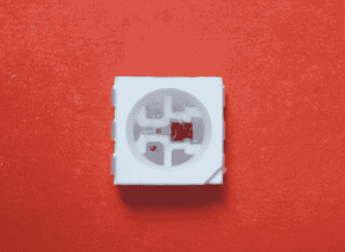

# 驱动 WS2811 LED 像素的三种概念性方法

> 原文：<https://hackaday.com/2013/01/02/three-conceptual-approaches-to-driving-a-ws2811-led-pixel/>

[cliny _ Fellow]发表了一篇文章，介绍了驱动 WS2811 LED 像素的三种概念验证方法。我们在 12 月初关注了一个项目，[使用 AVR 微控制器来驱动 RGB 包](http://hackaday.com/2012/12/07/driving-a-ws2811-rgb-led-pixel/)。[clin _ Fellow]看到了这一点，尽管他手头上没有这些部件，但他仍然花时间研究解决设备寻址时间问题的方法。在批评 Hackaday 上的项目时，他的座右铭是“要么提出，要么闭嘴”。我们喜欢看到有人提出一个想法并付诸实践。

这三种情况下的方法都旨在为通信计时时节省时钟周期。这让开发人员尽可能多的循环来执行其他任务，而不是简单地告诉灯做什么。一种方法是汇编例程，它稍微慢一点，但是将所有 14 个空闲周期组合成一个块。接下来将介绍如何使用外部 7400 系列硬件。最后一个技巧是老式的钻头敲打。

[ [照片来源](http://www.gree-leds.com/productshow.asp?ArticleID=V495PRYXTP)