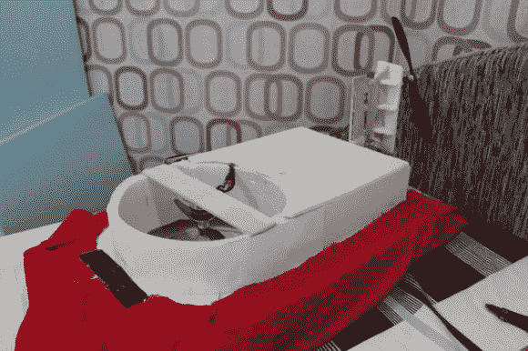

# 预算中的推力矢量气垫船

> 原文：<https://hackaday.com/2014/02/13/thrust-vectoring-hovercraft-on-a-budget/>

寻找一个有趣的推力矢量小实验？[Saral Tayal]提出了他认为的第一款推力矢量气垫船。

一个典型的气垫船使用一个或两个驱动器，一个用于悬停，一个用于引导运动——或者一个用于两者，转移到两个输出。[Saral 的]玩具气垫船使用两个，但与传统设计不同，它不是在背部有一个方向舵来引导气流进行转向，而是操纵整个风扇组件。在全尺寸的气垫船上，这可能会很有趣。

这是一个非常简单的项目，你可以很容易地在一个周末建立——如果你有钢筋混凝土部件踢来踢去，甚至更容易！他使用两个带 ESC 的无刷电机、一个 9g 伺服系统和一个小型遥控发射器/接收器。这些道具来自一架普通的遥控飞机——只需选择一架适合所用发动机的即可。取决于你手头上有什么，这个项目将低于 100 美元建立。其余的大部分是泡沫板、轻木和胶水。

看看下面的视频，看看它是如何悬浮的！

[https://www.youtube.com/embed/UIcjZkyWrkg?version=3&rel=1&showsearch=0&showinfo=1&iv_load_policy=1&fs=1&hl=en-US&autohide=2&wmode=transparent](https://www.youtube.com/embed/UIcjZkyWrkg?version=3&rel=1&showsearch=0&showinfo=1&iv_load_policy=1&fs=1&hl=en-US&autohide=2&wmode=transparent)

对推力矢量感兴趣吗？看看当你把它放在飞机上会发生什么！