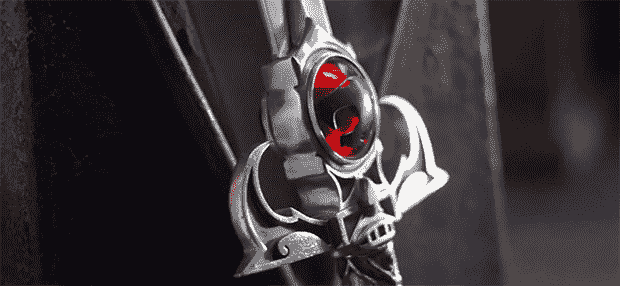

# Thundercats, HO!

> 原文：<https://hackaday.com/2013/06/26/thundercats-ho/>

[托尼·斯瓦特顿]，铁匠、军械师、道具制作师，为数百部电影和电视节目打造了数百把定制剑。他也是 YouTube 系列节目《拿起武器》(Man at Arms)的制作人，在这个系列节目中，你最喜欢的节目和电影中的武器被重新制作，无论它们是詹姆斯·邦德电影中不太可能的武器，还是漫画中的剑。这一次，[他重现了雷猫](http://www.youtube.com/watch?v=nm4Ck6bD2_0)中的预兆之剑。这本身就是一件艺术品，对于一把卡通剑来说非常实用。

预兆之剑是[托尼]所做的更复杂的铸剑作品之一。剑柄由七块不同的青铜铸造而成，而剑柄由十几块不同的钢焊接而成。剑中的宝石是从一块玻璃上切割下来的，在宝石轮上小心地打磨成完美的圆顶。

当然，这并不是[托尼]打造的来自大众媒体的唯一武器。他还完成了《詹姆斯·邦德》中的《怪人的帽子》和《冒险时间》中的《T2·芬恩的金色战斗之剑》。