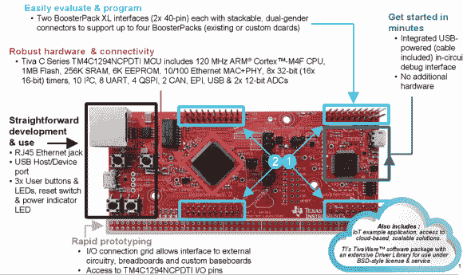

# TI 推出“互联发射台”

> 原文：<https://hackaday.com/2014/03/06/ti-launches-connected-launchpad/>

TI 的 LaunchPad 板一直以来都是低成本和全功能的。TI 的每个主要处理器系列都有一个主板，所有这些主板都支持相同的“BoosterPack”接口，以实现更多功能。今天，TI 宣布了一个基于他们新的 Tiva C ARM 处理器的新的 LaunchPad，它是为连接而设计的。

Tiva C 系列连接启动板基于 [TM4C129x](http://www.ti.com/lsds/ti/microcontroller/tiva_arm_cortex/c_series/tm4c129x_series/overview.page "TM4C129x") 处理器家族。这些芯片提供了一个以太网 MAC 和 PHY，所以唯一需要的外部零件是磁性和一个插孔。这使得“互联启动板”成为接入以太网和构建需要互联网连接的设计的一种简单方式。

该开发板专注于“物联网”，这似乎是当今每个硅制造商都在关注的问题。然而，真正的新闻是具有大量连接的低成本板，包括以太网、两个 can、8 个 UARTs、10 个 I2C 和 4 个 QSPIs。这足以支持两个完全独立的 BoosterPack 连接器。

为了此次发布，TI 与 Exosite 合作，提供从互联网轻松访问发射台的服务。一个预装的演示应用程序将允许您切换 led，读取按钮状态，并使用 Exosite 通过互联网测量温度。与过去的一些 LaunchPads 不同，这款产品旨在实现简单的试验板，所有 MCU 引脚都连接到试验板兼容接头。

最后，价格非常合适。该板将以 19.99 美元发行。这还不到其他以太网开发板价格的一半。这使得它成为黑客的一个有吸引力的解决方案，这些黑客希望将设备放在有线网络上，或者需要在各种设备和网络之间建立网关。