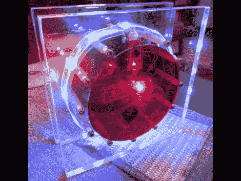

# 时间和日期时钟使用 RGB LED 条

> 原文：<https://hackaday.com/2012/05/17/time-and-date-clock-does-it-with-rgb-led-strips/>

彩色时钟真的很好地组合在一起。主体大部分是丙烯酸，有两个大的透明正方形和一对彩色圆盘。所有这些都由一个带垫片的硬件环固定，用于显示时间和日期的 RGB LED 灯条包裹在垫片周围。这将组件隐藏在中央，USB 线连接到 Arduino 兼容板，为设备供电。

小时显示为红色，分钟显示为绿色，蓝色用作背景色。在中间，你可以看到两个红色发光二极管中的一个，它们像钟摆一样交替排列，标记过去的秒数。每 10 分钟、15 分钟和 30 分钟都有定时事件。在第 15 分钟时，时钟开始显示日期。另外两个事件是让事情保持有趣的动画。只需使用安装在时钟背面的两个瞬时按钮，即可访问时钟的所有设置。

[https://www.youtube.com/embed/LSoxjS7H7JY?version=3&rel=1&showsearch=0&showinfo=1&iv_load_policy=1&fs=1&hl=en-US&autohide=2&wmode=transparent](https://www.youtube.com/embed/LSoxjS7H7JY?version=3&rel=1&showsearch=0&showinfo=1&iv_load_policy=1&fs=1&hl=en-US&autohide=2&wmode=transparent)