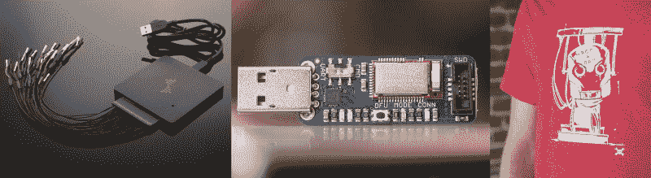

# 奖励时间到了:大水

> 原文：<https://hackaday.com/2015/04/07/time-for-the-prize-big-water/>

几周前，我无意中发起了一场激烈的辩论，关于[淋浴反馈回路](http://hackaday.com/2015/03/18/we-have-a-problem-shower-feedback-loop/)的*获奖时间*的帖子。那场辩论是关于限制家庭用水的影响，因为家庭用水在总用水量中所占的比例相对较小。我认为我们应该考虑问题的所有方面的解决方案，所以本周我们将寻找在大规模使用情况下有助于节约用水的想法。这些主要是农业和工业，但如果你知道其他人，请随时提出你的情况。

根据美国农业部的数据，大约 80%的地下水和地表水用于农业。我对听到关于水权之类的争论并不特别感兴趣(如果你想了解更多，这里有[一篇相当有趣的文章](http://www.washingtonpost.com/blogs/govbeat/wp/2015/04/03/agriculture-is-80-percent-of-water-use-in-california-why-arent-farmers-being-forced-to-cut-back/))。农业生产食物，并雇用许多人。冲突当然是漫长的生长季节与严重干旱加剧的缺水。即使我们可以将我们的食品生产转移到其他地方，也要迁移支持它的基础设施，这将是一个巨大的工程。当然，我们需要展望未来，但是我们现在能利用我们的工程技术来保护现在正在使用的水吗？

## 带着一个想法进来

在 [Hackaday.io](http://hackaday.io) 上写下你对农业和工业节水项目的想法。给项目贴上标签[2015 黑客大奖](http://hackaday.io/projects/tag/2015HackadayPrize)。在下周一之前做到这一点，你就有机会获得本周的大奖。

你不一定要承诺完成构建。在这一点上，我们想让想法机器运转起来。一个好的想法可能引发突破，使世界发生真正的变化。

## 本周的奖品

我们将挑选三个最好的想法，基于它们帮助缓解一个广泛问题的潜力，这个概念所显示的创新，以及它的可行性。第一名将获得一台 [DSLogic](http://store.hackaday.com/products/dslogic) 16 通道逻辑分析仪。第二名将获得一个苹果[蓝果](http://store.hackaday.com/products/bluefruit-le-sniffer-bluetooth-low-energy-ble-4-0-nrf51822-v1-0)蓝牙低能耗嗅探器。第三名将获得一个 Hackaday [机器人头部球座](http://store.hackaday.com/products/robot-head-tee)。

* * *

#### 2015 年[黑客日奖](http://hackaday.io/prize)由以下机构赞助:

