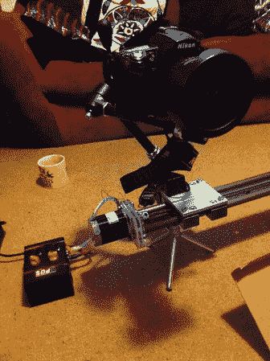

# 延时摄影小车使用一些库存零件和一些机械加工工作

> 原文：<https://hackaday.com/2013/03/06/time-lapse-dolly-uses-some-stock-parts-and-a-bit-of-machining-work/>

[Ben]刚刚完成[这个延时摄影小车](http://www.section9.co.uk/posts/2013-03-04-Timelapse.html)的制作，并决定分享他的经验。我们认为他在 diy 和市场上可买到的材料之间取得了恰到好处的平衡，创造了一个稳定而相对便宜的钻机。

这个项目的灵感来自于 Chronos 项目。它给出了许多关于驱动电路和所用代码的细节，但在建造赛道本身的说明中有一些空白。[Ben]勇往直前，从 IGUS 购买直线轴承和双导轨。他没有提到那个项目的价格，但我们发现 1000 毫米(约 40 英寸)的东西不到 75 美元，所以这不是离谱的。他无法以合理的价格买到的零件是精密螺纹杆。他最终用普通的螺纹杆和几个螺母结合一个弹簧机构来保持雪橇的稳定。这似乎工作得很好。您可以看到，在中断后，视频中的杆会有一点反弹，但这不会影响拍摄图像的稳定性。

终点挡板包括安装步进电机的那一个都是他自己的作品。听起来他们需要比他计划的多一点的制作工作，但我们认为如果你不挑战你的技能，你永远不会变得更好。

[https://www.youtube.com/embed/sluvAehKTwg?version=3&rel=1&showsearch=0&showinfo=1&iv_load_policy=1&fs=1&hl=en-US&autohide=2&wmode=transparent](https://www.youtube.com/embed/sluvAehKTwg?version=3&rel=1&showsearch=0&showinfo=1&iv_load_policy=1&fs=1&hl=en-US&autohide=2&wmode=transparent)