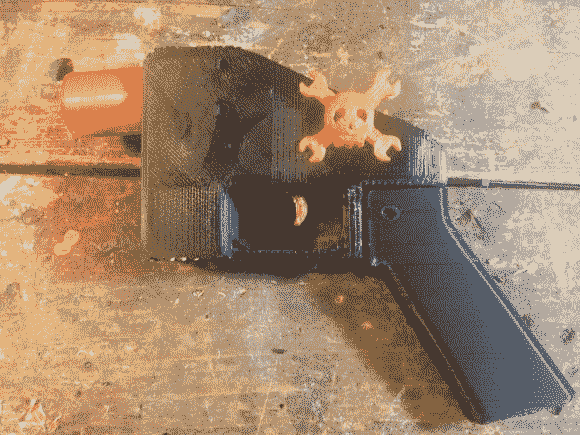
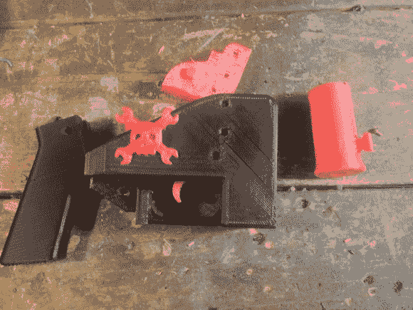
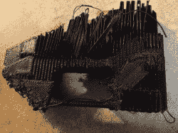
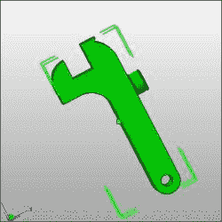

# 正在打印的 3d 打印枪的延时。

> 原文：<https://hackaday.com/2013/05/16/timelapse-of-the-3d-printed-gun-being-printed/>

[https://www.youtube.com/embed/MbdTShDxig4?version=3&rel=1&showsearch=0&showinfo=1&iv_load_policy=1&fs=1&hl=en-US&autohide=2&wmode=transparent](https://www.youtube.com/embed/MbdTShDxig4?version=3&rel=1&showsearch=0&showinfo=1&iv_load_policy=1&fs=1&hl=en-US&autohide=2&wmode=transparent)

一旦国防部要求从互联网上删除 3d 打印枪支文件，就会发生一些事情。

1.  史翠珊效应全面爆发。该文件被共享，仍然可以很容易地找到。
2.  我突然意识到，我将打印一把 3d 打印枪，并就此写另一篇文章，尽管我刚刚写了一篇关于我如何不在乎的观点文章。

我承认我很幼稚。我被告知我不能拥有这个东西，突然我知道我必须要制造它。我经常和我的孩子一起看。玩具可以放在角落里积灰很长时间，但当它面临被移走的威胁时，他们会重新产生兴趣，至少是几分钟。

我想，如果我要幼稚地打印一把枪，a)因为我没有合适的打印机而无法使用，b)因为我通常不玩枪，我也不会使用它，我还不如制作一个有趣的延时视频，展示正在制作的更容易识别的部件。

最初看起来它会变得又快又简单。然而，我很快发现，仅仅是打印这个东西将是一个耗时和令人沮丧的任务。

**1。单个文件的比例相差甚远。**

我怀疑这与它所设计的打印机有关。它看起来非常接近 1 英寸= 1 毫米。这不是一个完全不常见的问题。手动调整大小让一些文件看起来合适，但我发现许多根本不会调整大小。

**2。几乎每一项都有错误。**

如果你做过 3d 打印，你会发现一个模型可能会有各种各样的问题，这将阻止它正确打印。我发现枪的每一项都有错误。我其实从这个练习中学到了很多如何修复非流形的物品，所以最后还是不错的。

有些项目，如锤子和锤子弹簧，根本无法打印。我在系统中运行它们来修复它们并修正错误。它会说一切都是固定的，但当我试图“切片”打印时，软件会崩溃。这意味着我的枪不完整。它没有锤子。对我来说没什么大不了的。

the whole gun

Note that it is missing the hammer mechanism. More on that later.

disassembled

trigger spring. Cool design, I might use this idea for something else later

black: initial print with errors. Red: fixed print.

the gopro fell into the printer stopping it from moving the bed correctly. You can see the top two layers are shifted about an inch. The rest of that mess is just support material I was ripping out.

The hammer that refused to print correctly despite repeated repairs.

what the hammer was supposed to look like.

the spring that crashed my slicing program every time I tried to prepare it for a print.

我现在在乎吗？

没有。我爬到冰箱顶上，拿了我的饼干。我是一个快乐的孩子。事实是，压缩枪仍然更便宜，更容易，更安全，更可靠。这里有一个例子。

[https://www.youtube.com/embed/7Va87gB_4AI?version=3&rel=1&showsearch=0&showinfo=1&iv_load_policy=1&fs=1&hl=en-US&autohide=2&wmode=transparent](https://www.youtube.com/embed/7Va87gB_4AI?version=3&rel=1&showsearch=0&showinfo=1&iv_load_policy=1&fs=1&hl=en-US&autohide=2&wmode=transparent)