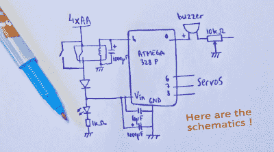

# 微型机器人爵士乐

> 原文：<https://hackaday.com/2015/05/27/tiny-robot-jazz/>

基于微控制器的项目不一定要花里胡哨才算精彩。例子:【r0d0t】的“[music omatic:the random jazz machine](http://r0d0t.tumblr.com/post/45022928402)”。巧妙的编程和漂亮的外壳可以将一些伺服系统和微控制器变成令人愉快的东西。

 硬件方面，这里真的没什么可看的；一个扬声器和一些伺服系统与 ATmega328 相连。我们认为让微控制器通过继电器控制自己的电源很可爱，但老实说，用 MOSFET 代替继电器或使用 [AVR 的关机睡眠模式](http://www.nongnu.org/avr-libc/user-manual/group__avr__sleep.html)会更好。

不，这个项目的亮点是编程。从技术上讲，它可能会让你们中的一些人畏缩——充满了阻塞延迟和其他编码“禁忌”。但这些都不重要，因为[r0d0t]把他的工作放在了重要的地方:音乐。休息过后，你一定要在视频中亲自聆听。

做出人类喜欢的音乐的基础是节奏，所以[r0d0t]并没有把这完全留给偶然性。数组“节奏”有七个随机选择的节拍模式。人类喜欢的另一件事是可预测性和重复，所以合唱和“即兴表演”也会重复。所有的随机音符都被限制在五声音阶，这使得它听起来不会太糟糕。(肯尼·g 的[秘制酱](http://www.jazzoasis.com/methenyonkennyg.htm))

简而言之，【r0d0t】把很多基本的乐理打包到一个很基本的装置里，想出了一些超验的东西。我们有点想起了[黄鼓机](http://hackaday.com/2013/01/08/robot-has-rhythm-carries-drum-sticks/)机器人，那可是好评。这两个项目都证明了构建简单的东西，然后将时间和精力投入到代码中，使项目变得令人敬畏。

想要进一步了解[r0d0t]出色的极简派，可以看看他对经典贪吃蛇游戏的看法:[扭曲的蛇](http://hackaday.com/2012/10/01/fantastic-programming-makes-this-arduino-gaming-device-something-special/)。

[https://www.youtube.com/embed/bMw7JR2N3SU?version=3&rel=1&showsearch=0&showinfo=1&iv_load_policy=1&fs=1&hl=en-US&autohide=2&wmode=transparent](https://www.youtube.com/embed/bMw7JR2N3SU?version=3&rel=1&showsearch=0&showinfo=1&iv_load_policy=1&fs=1&hl=en-US&autohide=2&wmode=transparent)