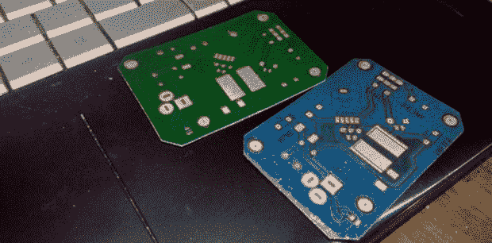

# 墨粉转移印刷电路板，双面，彩色丝网印刷

> 原文：<https://hackaday.com/2014/01/27/toner-transfer-pcbs-double-sided-with-color-silkscreen/>

用墨粉转移法制造一些 PCB 是黑客和制造商圈子里众所周知的技术。双面多氯联苯稍微少见一些，但仍然使用与单面多氯联苯相同的工艺。[死灵法师]更上一层楼，做一些我们从未见过的事情——[家庭制作的双面印刷电路板，彩色丝网印刷，都是用激光打印机制作的](http://ncrmnt.org/wp/2014/01/26/toner-transfer-now-in-color-and-with-silkscreen/)。

为了铺设蚀刻掩模，[尼布鲁]正在使用三星 ML-2167 激光打印机和通常的墨粉转移过程；把板画打印出来，贴在一些铜板上。

阻焊膜使用类似的过程，非常相似，并且产生了很好的结果:一旦电路板被蚀刻，他就打印出电路板的阻焊膜层，将其层压，然后剥离纸张。这太简单了，我们唯一想知道的是为什么以前没有人想到它。

除了多层的潜在对准问题，这种制造技术唯一缺少的是电镀通孔的能力。不过，用激光打印机、层压机和一点氯化铁或氯化铜，你也可以在家里制作一些非常好的木板。