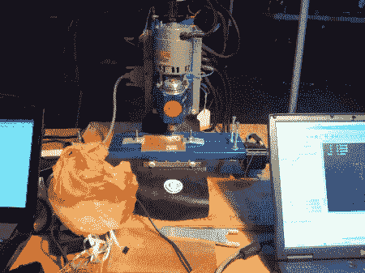

# Toorcamp:用 KiCad 铣削 PCB

> 原文：<https://hackaday.com/2012/08/16/toorcamp-milling-pcbs-with-kicad/>

[Noisebridge](https://www.noisebridge.net "Noisebridge") 的郝向我展示了他们用来蚀刻 PCB 的数控铣床。使用覆铜板，这 MAXNC 10 轧机路线的 PCB 与体面的准确性。这有助于单面 PCB 的快速原型制作。

[Hao]使用开源的 [KiCad](http://www.kicad.org "KiCad") EDA 工具设计 PCB。这用于绘制原理图、PCB 布局和生成 Gerber 文件。接下来， [pcb2gcode](http://sourceforge.net/apps/mediawiki/pcb2gcode/index.php "pcb2gcode") 用于将 Gerbers 转换为 [G 代码](http://en.wikipedia.org/wiki/G-code "G-code")，g 代码是控制 CNC 设备的标准指令集。最后， [LinuxCNC](http://www.linuxcnc.org/ "LinuxCNC") 被用来发送 g 代码指令到轧机。这是一个完全开源的工作流程的强大应用。

被研磨的 PCB 用于基于压力的触摸传感器。它使用装在橡胶外壳中的 Freescale [MPL115A](http://www.freescale.com/webapp/sps/site/prod_summary.jsp?code=MPL115A "MPL115A") 气压传感器。这个传感器正被整合到的 Dora 开源机器人助手项目中，这个项目是郝和 Noisebridge 的人正在做的。我们期待着将来听到更多关于 Dora 项目的消息。