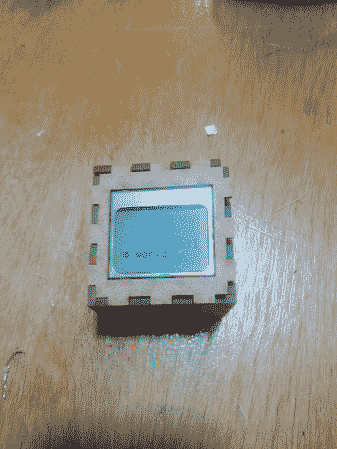

# Toorcamp: Nibble Node.js 小部件

> 原文：<https://hackaday.com/2012/08/20/toorcamp-nibble-node-js-widget/>

Toorcamp 的硬件黑客村为硬件工作提供了空间和工具。看看人们带来了什么样的硬件技术是很有趣的。一个例子是[ [欧文](http://hackniac.com "Owen") ]的[啃](http://www.hackniac.com/blog/?p=1208 "Nibble") Node.js 小部件。这个小工具结合了流行的 [node.js](http://nodejs.org/ "node.js") 平台和定制硬件，为“物联网”创建了一个节点硬件包括一个 Arduino Pro Micro、一个蓝牙模块、一个 LCD 显示屏和一个激光切割盒中的扬声器。

通过使用 node.js 中的自定义包，半字节变成了一个可以被其方法控制的对象。这允许开发者将消息推送到显示器并控制设备，而不用担心硬件的细节。因为 node.js 是为 web 应用程序设计的，所以很容易从 web 上控制设备。

[Owen]还为即将到来的游戏 [0x10c](http://0x10c.com/ "0x10c") 中的 DCPU 编写了一个模拟器。DCPU 程序集是从 node.js 传入的，node . js 编译它并将其发送给半字节。然后，设备可以使用 DCPU 仿真运行应用程序，这也允许控制显示器和扬声器。

有很多巧妙的事情可以用这个小小的立方体来完成，而且[Owen]计划为 node.js 代码发布一个 NPM 包。