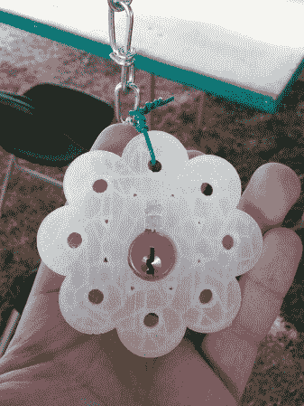

# 图坎普:开锁村

> 原文：<https://hackaday.com/2012/08/17/toorcamp-the-lock-picking-village/>

开锁人的公开组织在 Toorcamp 经营开锁村。他们举办了关于撬锁如何工作的大型研讨会，提供了许多流行锁的安全缺陷的例子，并让每个人练习使用他们的锁和工具。开锁有点上瘾，我在村子里呆了很长时间。

TOOOL 是一个国际组织，旨在提高公众对锁和开锁的认识。如果你曾经想了解更多关于锁的知识，你可以查看他们的[章节列表](http://toool.us/meetings.html "TOOOL Meetings")看看你所在的地区是否有，或者给他们发一封电子邮件，看看你附近是否有其他开锁爱好者。他们为奥运村拍摄的详细的[幻灯片](http://toool.us/resources.html "TOOOL Resources")也可以获得。

TOOOL 的 Eric 致力于建造一个开锁装置叫做锁的迷宫。第一个原型由封闭在 3D 打印外壳中的锁组成，并由 led 照明。目标是把它们挂在树林里，挑战人们找到并撬开锁。MakerBot Industries 打印了橙色和花朵形状的外壳，led 和锁安装在其中。

这是第一个原型，[Eric]计划扩展这个想法，并在他参加的其他开锁活动中使用它。这是一种将开锁和艺术装置融入互动活动的巧妙方式。