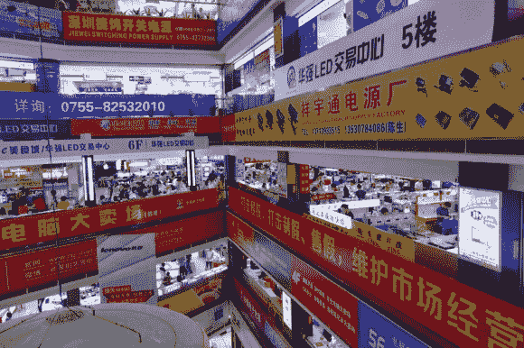

# 参观深圳的零部件市场

> 原文：<https://hackaday.com/2013/09/28/touring-component-markets-in-shenzhen/>

[Al]最近刚从中国旅行回来。在那里，他参观了世界电子组装中心深圳的一些零部件市场。虽然他并不太关注那里到底在卖什么，但我们发现他对市场本身和该地区其他著名景点的描述非常有趣。

深圳不同于我们听说过的其他一些神奇的地方(想到了[Ian Lesnet]的日本秋叶原之旅)。首先，到达那里可能有点困难。美国公民需要签证才能进入中国，必须飞到香港，然后乘坐渡轮前往大陆。[Al]报道称交通状况非常糟糕，高峰时间通常需要 90 分钟的 10 英里路程变成了 3 小时的旅行……*3 小时的旅行！*

远离市场的副作用是，价格不会像在更适合极客游客的地方那么高。也就是说，听起来供应商对卖给你几千个单元感兴趣，而不是一个组件。跟随顶部的链接进行市场之旅，在 Seeed Studios 停留(他们显然会卖给你一张最佳市场的地图)，以及[Al]遇到的其他景点。