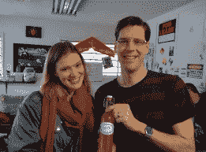
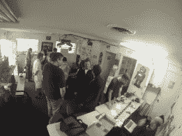
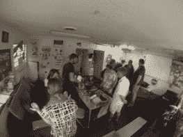
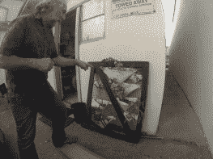
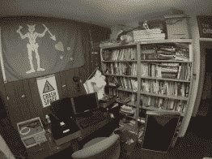
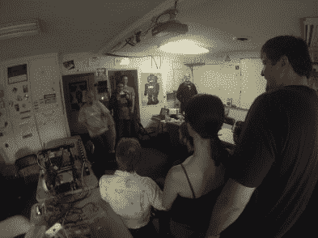
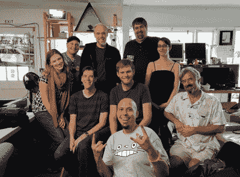

# 游览 Crashspace，LA Hackerspace

> 原文：<https://hackaday.com/2014/01/20/touring-crashspace-the-la-hackerspace/>

如果你不了解 Hackaday 的最新动态，[我们明天将在洛杉矶举办派对](http://hackaday.com/2014/01/06/come-build-the-hackaday-community/)。这意味着参观所有当地的黑客空间，并乞求参观。首先是[碰撞空间](http://blog.crashspace.org/)，这是一个令人敬畏的黑客空间，使用 Starsong，上面显示的烙铁 alicorn 作为吉祥物。

在碰撞空间内是通常的黑客空间，包括桌子、投影仪、白板和比你摇动几根 ide 电缆还多的回收电脑。当我们到达 Crash Space 时，他们刚刚结束他们每周一次的 3D 打印研讨会，里面装满了一台 Mendel Max 打印机(不能透露其名称)，以及一对来自 [Deezmaker](http://deezmaker.com/) 的打印机，该公司由 Crash Space 的一名成员创办。

对于任何想卷起袖子变脏的人来说，所有的行动都从大楼的后面开始。在那里，他们有一台激光切割机，一台古老的车床和磨机，钻床，甚至还有一个将成为真空成型机的项目。

Crash Space 的工作人员很友好地展示了他们的工作室的一段视频，下面是一些空间活动的照片。

[https://www.youtube.com/embed/ZXLxCMCaoK4?version=3&rel=1&showsearch=0&showinfo=1&iv_load_policy=1&fs=1&hl=en-US&autohide=2&wmode=transparent](https://www.youtube.com/embed/ZXLxCMCaoK4?version=3&rel=1&showsearch=0&showinfo=1&iv_load_policy=1&fs=1&hl=en-US&autohide=2&wmode=transparent)

  Brian and Daryll pose with Sparkles  Carlyn gave us some Limoncello she made herself            The CrashSpace crew with Mike