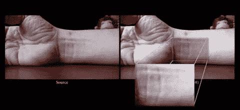

# 跟踪视频中的微小变化来观察某人的脉搏

> 原文：<https://hackaday.com/2012/06/04/tracking-small-changes-in-video-to-see-someones-pulse/>

[吉尔]发来了今年 SIGGRAPH 的一篇很棒的论文[。这是一种从麻省理工学院计算机科学与人工智能实验室和量子研究中心的[巫浩裕、*等人的*视频中检测细微变化的方法。为了感受这篇论文的内容，](http://people.csail.mit.edu/mrub/vidmag/)[看看视频](http://www.youtube.com/watch?feature=player_embedded&v=ONZcjs1Pjmk)，当你惊讶的时候再回来。

该项目通过检测和放大几帧视频中出现的非常小的颜色变化来工作。从演示中，研究人员能够通过注意到当他们的脸上充满血液时他们皮肤颜色的微小变化来检测他们的脉搏。

检测颜色微小变化的一个很好的副作用是能够检测到*运动*。在视频中，有一个通过夸大某人手腕上扩张的动脉来检测某人脉搏的例子，以及太阳在 15 秒内产生的阴影的变化。这是蝙蝠侠级别的技术，我们迫不及待地想看到 OpenCV 库。

尽管研究人员展示了极其有限的用例——只有脉搏和呼吸——但我们看到了大量的潜在应用。我们很乐意看到这项技术的开源版本成为即将到来的美国总统辩论的测谎仪，动作夸张是展示为什么每个体育裁判都像蝙蝠一样瞎的完美。

如果你想阅读真正的论文，[这里有 PDF 文件](http://people.csail.mit.edu/mrub/papers/vidmag.pdf)。一如既往，休息后的视频。

[https://www.youtube.com/embed/ONZcjs1Pjmk?version=3&rel=1&showsearch=0&showinfo=1&iv_load_policy=1&fs=1&hl=en-US&autohide=2&wmode=transparent](https://www.youtube.com/embed/ONZcjs1Pjmk?version=3&rel=1&showsearch=0&showinfo=1&iv_load_policy=1&fs=1&hl=en-US&autohide=2&wmode=transparent)