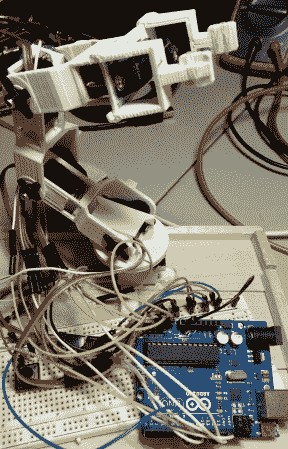

# 可训练的机器人手臂

> 原文：<https://hackaday.com/2013/12/22/trainable-robotic-arm/>

当[Robert]意识到 Adafruit 现在正在销售模拟反馈伺服系统时，他决定他只需要制造一个可编程的机械臂,它可以像商用的[Baxter 机器人一样被训练。](http://www.rethinkrobotics.com/products/baxter/)

模拟反馈伺服系统的巧妙之处在于，它消除了训练机器人的所有复杂性。你所要做的就是将机器人置于示教模式，将机器人的关节移动到你想要的位置，然后保存你的程序！根据你的应用，这当然比试图解决有趣的运动学方程要好…

总之， [Adrafuit 的学习系统](http://learn.adafruit.com/trainable-robotic-arm)上的完整指南提供了如何从头开始建造自己的手臂(嗯，用 3D 打印机)或如何替换你可能已经有的预制玩具机械臂中的伺服系统的指导。它非常全面，包括你需要的所有 Arduino 代码。

休息后留下来看看机器人是如何工作的！

[https://www.youtube.com/embed/w9rehmxvOOw?version=3&rel=1&showsearch=0&showinfo=1&iv_load_policy=1&fs=1&hl=en-US&autohide=2&wmode=transparent](https://www.youtube.com/embed/w9rehmxvOOw?version=3&rel=1&showsearch=0&showinfo=1&iv_load_policy=1&fs=1&hl=en-US&autohide=2&wmode=transparent)