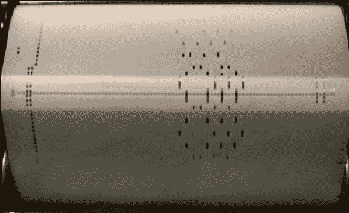

# 用 Python 改编钢琴卷首

> 原文：<https://hackaday.com/2014/04/12/transcribing-piano-rolls-with-python/>

被称为钢琴卷纸的穿孔纸卷被用来将歌曲输入到播放器钢琴中。上面的图片来自 YouTube 的一段视频，视频显示一架钢琴正在演奏格什温的曲子《莱姆豪斯之夜》。这首歌没有公开的乐谱，所以[Zulko]决定[用 Python 转录它](http://zulko.github.io/blog/2014/02/12/transcribing-piano-rolls/)。

首先，视频是从 YouTube 上下载的。这个视频是用 [MoviePy](http://zulko.github.io/moviepy/) 库处理的，以创建一个绘制笔记的单一图像。使用傅立叶变换，发现了音符之间的水平间距。这允许图像被缩小，以便一个像素对应一个键。

完成后，每一列都可以分配给钢琴上的一个特定音符。这就解决了音高问题，但是音符长度需要更多的处理。再次应用傅立叶变换来确定四分音符的长度。知道了这一点，音符可以被量化，音符长度可以应用于每个音符。

一旦知道了持续时间和音符，就该导出乐谱了。使用了音乐符号的开源语言 LilyPond。这将把 ASCII 文本转换成乐谱 PDF。最后的结果是一个可播放的乐谱，你可以在休息后观看。

[https://www.youtube.com/embed/V2XCJNZjm4w?version=3&rel=1&showsearch=0&showinfo=1&iv_load_policy=1&fs=1&hl=en-US&autohide=2&wmode=transparent](https://www.youtube.com/embed/V2XCJNZjm4w?version=3&rel=1&showsearch=0&showinfo=1&iv_load_policy=1&fs=1&hl=en-US&autohide=2&wmode=transparent)