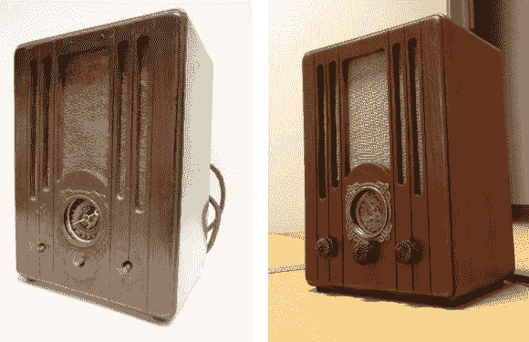

# 变废为宝蓝牙收音机和电子管放大器建设

> 原文：<https://hackaday.com/2013/09/22/trash-to-treasure-bluetooth-radio-and-tube-amp-build/>

之前的图像看起来没有那么糟糕，但我们仍然对这台收音机的修复留下了深刻的印象。也许修复不是一个正确的词，因为它没有设法保持任何原始的内部结构。这是一个复古收音机套的复活，可用作蓝牙收音机。

乍一看，我们没有注意到原来的旋钮不见了。扬声器织物被撕裂，调谐盘上的玻璃也被打破。[Yaaaam]碰巧有另一个古董收音机，旋钮很有趣——但他不只是移植了它们。他做了一个旋钮的模具，并铸造了三个收音机的替代品。在对木材进行抛光后，他更换了布料，情况开始好转。

所有的电子元件都被移除，一个新的电子管放大器建立在原来的金属底盘上。它使用蓝牙模块输入，方便使用您的智能手机作为播放设备，而不涉及任何电线或其他废话。项目完成后出现了两个问题。第一个替换电源过热。第二次更换有一个不同的问题，需要一些额外的屏蔽，以防止噪音产生不必要的…噪音。

这看起来比现代注塑塑料搁板系统好得多。但是对于那些人来说，也有一些有趣的无线技术。