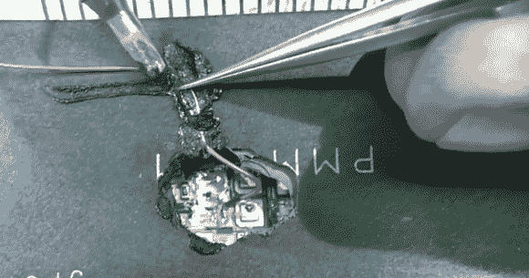

# 数控机床电源驱动器的巧修

> 原文：<https://hackaday.com/2013/11/22/tricky-repair-of-power-driver-for-cnc-machine/>

从头开始设计和制造东西是一回事。但是修理被烧坏的电子设备是一种完全不同的黑暗艺术。这个视频来自于一年多以前，但是我们不认为你会介意，因为他在视频中的成就令人印象深刻。他有一个烧坏的拾放[混合动力模块，它不会自己修复](http://www.youtube.com/watch?v=DGqH8LGjZdY)。

电源模块结构包括一个具有板载芯片型 MOSFETs 的器件，以及封装在黑色塑料外壳中的电路。这有点像一个子模块被集成电路用同样的塑料封装起来。打开后，看起来焊线已经烧掉了。[Mike]将跳线连接到其中一个电路板走线，以便使用外部 MOSFET。这说起来容易做起来难，因为模块基板是为散热而设计的陶瓷。我们被他将跳线熔入塑料外壳的技术逗乐了，以保护它免受封装上的散热片的影响。最后，他让他的计算机数控系统再次运行。这可能不是最好的长期解决方案，但他只需要继续运行，直到合适的替换部件到来。

哦，还有一件事:他在视频中使用的 Metcal 真空脱焊器…确实想要！

[https://www.youtube.com/embed/DGqH8LGjZdY?version=3&rel=1&showsearch=0&showinfo=1&iv_load_policy=1&fs=1&hl=en-US&autohide=2&wmode=transparent](https://www.youtube.com/embed/DGqH8LGjZdY?version=3&rel=1&showsearch=0&showinfo=1&iv_load_policy=1&fs=1&hl=en-US&autohide=2&wmode=transparent)

[通过 [Reddit](http://www.reddit.com/r/electronics/comments/1r3ils/this_guys_skill_never_ceases_to_amaze_me/) 感谢好友]