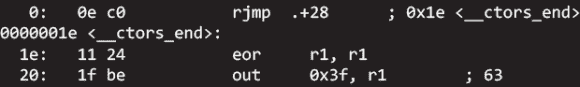

# 修剪脂肪从 AVR GCC

> 原文：<https://hackaday.com/2013/12/06/trimming-the-fat-from-avr-gcc/>

[Ralph]一直在为 ATtiny85 开发一个非常小的引导程序，尽管汇编语言在这方面确实有一些优点，但用 C 语言编写和使用 AVR Libc 要方便得多。通过他将代码精简到最低限度的尝试，他找到了一些方法来轻松地将 AVR-GCC 编译的代码减少几个字节。

为了测试他的想法，[Ralph]首先编写了一个短程序来读取 ATtiny85 的内部温度传感器。在反汇编代码时，他发现在跳转到 main 之前有一个到名为 __ctors_end:的函数的跳转。根据 ATtiny85 数据手册，该调用将 IO 寄存器设置为初始值。这些初始值是 0，所以可以节省 16 个字节。该函数还将堆栈指针设置为初始值，因此可以优化掉另外 16 个字节。

如果你没有使用中断，你可以通过删除中断向量表来删除 30 字节的代码。最终，[拉尔夫]能够将一个 274 字节的程序精简到 190 字节。与 tiny85 上的 8k 闪存相比，这是一个很小的节省，但如果你想用你的头来撞击这种微型存储的限制，这可能是一个好的开始。

现在，如果你想听一些关于优化代码的故事，你必须看看《曾经的雅达利 纪录片 [*。他们花了几个月的时间手工优化代码，使其适合墨盒。*](http://www.onceuponatari.com/)