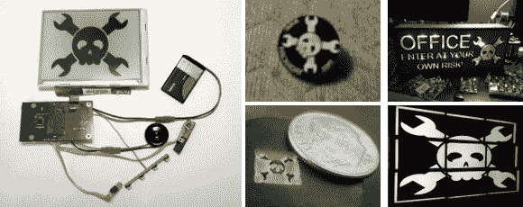
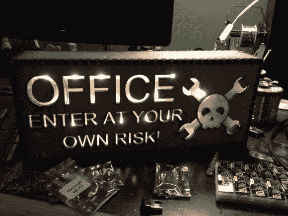
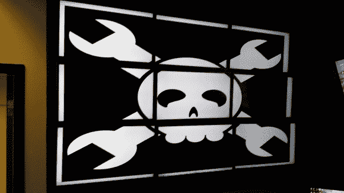
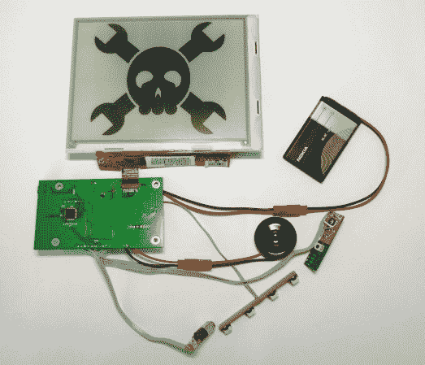

# 饰品比赛更新#1

> 原文：<https://hackaday.com/2013/10/24/trinket-contest-update-1/>

小饰品比赛的参赛作品开始蜂拥而至。挑战是把 Hackaday 的标志贴到某物上，用 20 个[小饰品开发板](http://www.adafruit.com/trinket)，Adafruit 把它们拿出来拍卖。这里有五个早期的条目，我们将在跳转之后更详细地描述它们。请在 11 月 1 日星期五之前报名，有机会获得奖品。

这张模糊的图片描绘了一个 1 英寸的按钮，[Ken]用它来测试他的激光切割机的设置。不知道如何处理这些蚀刻出来的小玩意，他把它们交给了自己的黑客空间，希望它们能找到一个好归宿。

这个激光切割的标志是本的杰作。1/4”胶合板背光 led 警告游客谁是接近他的男人洞穴。

把头骨和扳手扔在他的 9 个 32 英寸的屏幕上是[Chad]能想到的最简单的方法来扩大比赛。

[Joshua]走了相反的路，把一个小标志磨成一个可丽安冰球。他认为这个标志实际上看起来比显示的要好一些，但他不得不用记号笔手工绘制黑色标志，并且没有足够好的放大倍数来做更好的工作。我们认为它看起来很棒，而且确实很小！

这是一款电子墨水显示器，Petteri 以相当低的价格(大约 30 美元左右)买到，因为它们是用来替代坏掉的电子书阅读器的。他一直在研究驱动显示器的细节，并自己设计了基于 STM32 的绿色控制板。令人印象深刻，我们很高兴[他实际上发布了相当多的关于版本](http://essentialscrap.com/eink/)的信息。