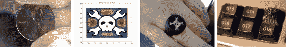
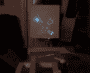
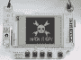

# 饰品比赛更新#4

> 原文：<https://hackaday.com/2013/10/31/trinket-contest-update-4/>

今天是我们收到你的小饰品比赛参赛作品的最后一天！休息之后你会发现又有一打选手被送进来了。如果你在等着看你自己的出现在这里，请耐心等待，因为我们有很多事情要做。

[比赛](http://hackaday.com/2013/10/21/pander-to-us-and-win-a-trinket/)要求你将 Hackaday 的标志贴到某物上，有机会赢得由 Adafruit 为本次比赛捐赠的 20 个[小饰品开发板](http://www.adafruit.com/trinket)中的一个。

我们从来没有意识到碾磨硬币实际上有多受欢迎。[David]跟随上一次更新的一角硬币条目，在一便士上有他自己的标志。他为没有显微镜来为他的作品拍照而道歉。

 【克里斯】在他的便携式 PS2 项目的背面蚀刻了这个标志。它可能看起来很熟悉，因为我们最近[单独介绍了黑客](http://hackaday.com/2013/10/28/portable-ps2-courtesy-of-cross-plane/)。

 这个词条出自【罗尼】。他使用双轴激光钻机在磷光表面上描绘出[头骨和骨头。](http://www.youtube.com/watch?v=-7pkXL3_lrI)

我们真的不明白这个是怎么做的。[Jonathan]正在做他的研究生工作，用有限元法研究地球物理学中的计算模型问题。他写道:“我提交的是一个简单微分方程的数值解，它位于一个形状像 Hackaday 标志的领域中。”。如果你想知道更多，请在评论中提问，希望他会给出答案。

 这是一张用 LED 灯绘制商标的长曝光照片。从[他的博客文章](http://markcra.com/blog/?page_id=160)中了解更多关于【马克的】钻机的信息。

 【约瑟夫】条目被绘制在字符 LCD 上。他发布了关于[他如何从矢量图形到自定义字符](http://devjoe.com/?p=375)的信息。

你可以通过[打印并佩戴你自己的 Hackaday 戒指](http://www.thingiverse.com/thing:172743)来加入秘密俱乐部。这是由[Rich]设计和分享的。

 在他的暑期实习中,【蔡斯】用一把乙烯切割器做了一堆贴纸。你应该认识 ATX 板凳供应黑客，他贴满了民政总署的标志。

 【鲍勃】用这个 logo 作为[他的银河 SIII 闪屏](http://www.youtube.com/watch?v=_osSkuxl4eU)。

说实话，每个人都需要一个专用的键盘键来加载 Hackaday，对吗？[Joshua]使用 SolidWorks 和 CorelDraw 为他的 Logitech G11 键盘设计按键。

【Anool】在他公开的硬件峰会徽章的 ePaper 显示屏上拍了一下 logo。如果你还没听说过这个硬件，看看我们的帖子详细介绍了 OHS 徽章。

 总结一下这篇文章，【哈桑的】diy Arduino LCD 盾牌非常适合展示他的小饰品竞赛参赛作品。