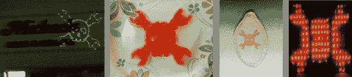
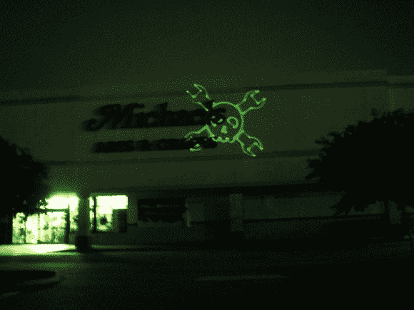
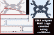
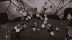
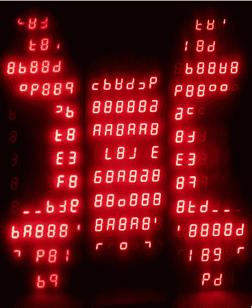
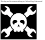

# 饰品比赛更新#6

> 原文：<https://hackaday.com/2013/11/02/trinket-contest-update-6/>

饰品大赛已经接近尾声，但我们仍将展示截止日期前收到的参赛作品。[竞赛](http://hackaday.com/2013/10/21/pander-to-us-and-win-a-trinket/)要求你将 Hackaday 的标志贴到某物上，有机会赢得由 Adafruit 捐赠的 20 个[小饰品开发板](http://www.adafruit.com/trinket)中的一个。休息之后看到一打选手展示。

【克里斯多夫】[用激光标签](http://www.fab-favreau.com/index.php/Main/LaserTagging)将商标贴在一家毫无防备的(晚上关门了)迈克尔的商店上。

 一个不同的【克里斯多夫】做了理论上的 DNA 折纸的标志。显然，这种数字设计可以在显微镜下订购和查看——这两件事他都没有时间和金钱去做。

 这个狡猾的屈服来自使用珀勒珠的[安德烈斯]。

这是第一个可食用的条目。[丹]用数控机器切割果冻。还有烤奶酪版本的。

 【克里斯】用他的多面骰子代表标志。

 【奈杰尔的】词条在一面原本枯燥的墙上贴满了便利贴。

同样以食物为主题和节日气氛的还有[John]在 Xerocraft hackerspace 制作的激光蚀刻南瓜籽。

 这个 3D 发光头骨和骨头来自【布兰登】

 【亚伦】将自己的作品投射在一所学校的侧面。

【Laurens】告诉我们这是银行的汇率标志。它坏了，他修好了它，用 Arduino 替换了旧的驱动程序。

 【索丁的】条目是一个小 ASCII 艺术，使用他的树莓 Pi 上的脚本生成。

 【卡勒姆】展示标志，作为[他的 NFC 标签所有权网页](http://www.youtube.com/watch?v=ZZlTcC7Zu8Y)的一部分。