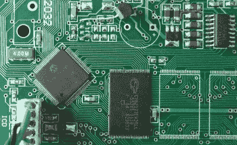
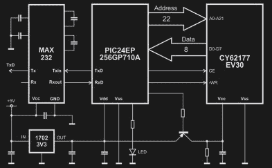

# 真正的黑客的真随机数发生器

> 原文：<https://hackaday.com/2015/06/29/true-random-number-generator-for-a-true-hacker/>

你如何生成随机比特？有些人认为这不容易，有些人会告诉你这太难了，还有一些人怀疑这是否可能。当然，在软件中创建一个非常长的伪随机序列是很容易的，但即使是最好的 [PRNG](https://en.wikipedia.org/wiki/Pseudorandom_number_generator) (伪随机数发生器)也需要一个好的[随机种子](https://en.wikipedia.org/wiki/Random_seed)，因为我们不想每次打开设备时都得到相同的序列，不是吗？这就是为什么我们需要一个 [TRNG](https://en.wikipedia.org/wiki/Hardware_random_number_generator) (真随机数发生器)，但这需要特殊的硬件。

一些高端微处理器配备了内部硬件 TRNG，但不幸的是，对于大多数低成本微控制器来说并非如此。黑客们用一些技巧来弥补。它们通常会启动内部的自由运行计数器，并在某些外部事件发生时(用户按下按钮等)获取其内容。这是可行的，但并非没有缺点。首先，存在“锁定”这两个事件的危险，因为定时器周期可能是输入扫描例程定时的某种衍生物。第二，自由运行时间(在接通和单元请求随机数的时刻之间)通常太短，导致种子太接近序列开始，因此是可预测的。甚至在某些情况下，在单元需要随机种子之前没有外部输入！

尽管已经讨论过，微控制器内部确实有真正的随机性来源。虽然对于加密应用来说可能不够好，但它仍然可以为娱乐游戏、模拟、艺术小工具等产生足够高的熵。

## 未初始化的 RAM

黑客经常利用超出其初始手段的硬件资源。这里我们将使用易失性 RAM，不是作为存储单元，而是作为熵的来源。

当 MCU 通电时，其内部易失性 RAM 有未知内容。每个触发器将被预设为 0 或 1 状态——这是内部电路不完善、电源故障、周围电流或热(甚至量子)噪声的结果。这就是为什么 RAM 每次上电内容都不一样的原因。

几年前，英特尔想出了一种生成真随机位的新方法，它使用一个调谐触发器，该触发器被强制进入亚稳态，然后以 3 MHz 的速率释放到稳定的 0 或 1 状态。他们宣布它将被嵌入到新一代的 T2 处理器中。

我们的 MCU 中没有经过调谐的触发器，但我们有许多触发器，我们可以预期其中一些会按照调谐的方式工作。使用易失性 RAM 内容创建一个好的随机数，我们真正需要多少个触发器？这当然取决于 MCU RAM 的性能，因此我们应该进行一些实验，看看在 MCU 上电后有多少位是不可预测的。这种不稳定性只出现在高度对称的触发器中，具有平衡良好的晶体管。我们需要那些不可预测的比特来收获熵，所以我们应该在初始化为一些已知值之前，使用尽可能多的数据——整个数据内存。我们没有可以迫使 RAM 触发器进入亚稳态的控制线，所以我们只能使用一次——在上电之后，初始化 RAM 之前。

## 实验

让我们看看典型的未初始化 MCU RAM 的内容。下图显示了 PIC18F2525 MCU 中一部分(20480 位)数据存储器的初始状态。每行有 256 位(32 字节)。1 是红色的，0 是黄色的。

显然，这个 MCU RAM 中的 1 比 0 少，但这并不重要。这里还有另外两个有趣的问题:第一，如果我们使用其他 MCU(即使来自同一条生产线)，这种模式是否会有所不同？对于相同的 MCU，下一次上电后会改变多少位？

你可能猜到了第一个问题的答案——是的，每个 MCU 都有完全不同的初始 RAM 模式。第二个问题更重要，答案是每次上电后没有多少位是不同的(不可预测的)。然而，有足够的产生几个随机字节。

下面是 PIC18F2525 开关两次的实验结果。灰色像素两次读取为 1，白色像素两次读取为 0，红色像素为“0，然后 1”，蓝色像素为“1，然后 0”。

经过一些试验后，您会发现通常一个 MCU 中的相同位在开启后是不可预测的。它们来自“好”触发器，代表了我们的熵的来源。我只测试了 Microchip 的 PIC18 和 PIC24E MCUs(结果如下所示)，但任何其他 MCU 都应该以类似的方式工作。这里显示的例子是在短 Vdd 上升时间(高压摆率)下产生的，因为开关位于 DC 电源和 MCU 之间。如果切换具有低压摆率的电源初级侧，您会注意到存储器内容中的一些模式，但不知何故，不稳定位的数量实际上会增加。

## 软件

所以，如果你需要一些随机字节(对于 [PRNG 种子](https://en.wikipedia.org/wiki/Random_seed)或者一些[幻数](https://en.wikipedia.org/wiki/Magic_number_(programming))，你可以使用未初始化的 RAM 内容来生成它们。您必须创建一个特殊的例程，该例程将对未初始化的 RAM 的某个块中的每个字节进行 XOR(或添加 MOD 256)运算，以生成第一个随机字节，然后是下一个字节的下一个块，依此类推。例如，如果您的 MCU 包含 RAM 的 4K(如 PIC18F2525，如果您包含 SFR 区域)，并且您需要 32 位种子，您可以将 RAM 分成四个 1024 字节的块，并使用它们来生成四个随机字节。即使一些块的一小部分已经被初始化(sfr 或例程循环的变量)，它也不会显著影响全局熵。大约十年前，我在 LED 窗帘中使用了这种技术，模拟了赌场中的瀑布。我为这个项目构建了许多单芯片 MCU 控制器，每个控制器都可以调暗 256 个可寻址的 led。RAM 随机种子和 32 位 PRNG 用最少的硬件创造了美丽的混沌。

你也可以在以后添加更多的置乱，例如，你可以从一个现有的定时循环(而不是 NOP 循环)中调用你的 PRNG 例程，这样它将被调用，大概，一个随机的次数，直到你的程序要求 PRNG 输出。如果单独使用，这个原理不会产生好的随机数序列，但是它不会导致 TRNG 性能下降，因为熵只会增加。

这种方法的主要限制是，如果有备用电池，或者如果使用睡眠模式而不是开-关开关，它就不能使用。然而，对于一些不太敏感的应用(如数字艺术或娱乐游戏)，您仍然有长 PRNG 序列来覆盖电池更换和新的复位之前的时间段，此时种子将被随机化。假设睡眠模式下的额外电流不会显著影响电池寿命，您也可以让外设计数器在睡眠模式下运行，稍后在 PRNG 种子加扰中使用。

我们必须记住，RAM 内容必须未初始化，并在加电后立即按原样使用。还建议避免高容量 Vdd 去耦，因为 CMOS RAM 保持电压可能非常低。最糟糕的情况是，如果您关闭器件很短一段时间，去耦电容的电压会下降到足以激活掉电复位，但不会扰乱 RAM 内容。幸运的是，RAM 的内容不太可能完全相同，因为总有一些 RAM 的“内务”部分(或至少 MCU 寄存器)会受到程序流的影响。RAM 中的多字节自由运行二进制计数器可以实现额外的安全性，即使程序不需要它，也不会读取它的状态。

有一些设计方法可以用来提高从易失性 RAM 中获取的随机数的质量。永远不要用零或任何其他内容初始化整个内存，只初始化必要的部分。如果不使用睡眠模式(而是关闭 Vdd)，则不要使用太高的去耦电容，或者至少使用一个额外的电阻与 MCU 电源并联。它会增加电源电流，但不会增加太多。即使通过该电阻的 MCU 总电源电流的 5%也足以防止电压锁定，当 Vdd 下降到 Idd 接近零时，或者甚至当一些外部元件向 MCU 提供电流时(一个美丽的例子在 *[《僵尸 Ram 的奥秘》](http://hackaday.com/2014/03/06/the-mystery-of-zombie-ram/)* 一文中描述)。该电阻确保随机存取存储器不会记住以前“重生”的任何东西，即使微控制器在关闭电源之前处于睡眠模式。

在网上搜索类似的想法和经历时，我偶然发现了一个主题为 *[的讨论，为什么我们不使用 CPU/RAM 来“真正”随机生成](http://www.reddit.com/r/compsci/comments/1h16mq/why_dont_we_use_cpuramusage_for_true_random/)* 。这个想法的作者受到了严厉的批评，主要是因为他建议对加密应用程序使用初始化的 RAM。我还找到了专利 [US5214423](https://www.google.com/patents/US5214423) ，也是基于类似的思路(用来降低总线访问重复碰撞的可能性)。这种专利申请吓到了每一个设计工程师，因为它让设计过程看起来像走过雷区——你永远不知道你什么时候可能会因为你的想法而被起诉。好消息是，这项专利的法律地位是“因未支付维护费而过期”，因此，希望我没有什么可担心的——至少这次是这样。

## 实验单位

第一个实验结果鼓励我构建一些使用未初始化的 RAM 内容来创建永久随机数据流的单元。因此，我将所描述的想法命名为“零概念”(使用未初始化的 RAM 内容创建种子)，然后构建三个单元来测试三个新概念。

    

1.  两个 pic 18 f 2525，8 位单向并行通信，支持简单握手。从 MCU 产生 16 个随机字节，每个字节基于 248 字节未初始化的内部数据 RAM。主 MCU(如上图中间所示)接收这些字节，并通过 RS232 端口将它们发送到台式 PC。在接收到一个 16 字节的字符串后，主 CPU 使用 PNP 晶体管关闭从 MCU 200 ms，这可能会创建新的随机 Ram 内容(根据我的实验，如果该单元关闭时间少于 85 ms，8 位 PIC MCUs 中的“僵尸 RAM”效应就会发生)。然后整个过程重复 625，000 次，总共 10 MB 的二进制数据，需要随机性测试。大约需要 50 个小时(平均速率为 56 字节/秒)。
2.  第二次测试使用相同的主 MCU，但这次从 MCU 是 16 位 MCU 24EP512GP202。所有 MCU 都在同一个 proto 板上(这就是为什么它们在同一个原理图上)，主 MCU 中的程序决定将使用哪个从 MCU。左侧的速度明显更快(70 MIPS 对 4 MIPS)，并且具有更多内部数据 RAM (48 K 而不是 4 K 字节)。一串随机数据包含 192 个字节，因此 10 兆字节的文件是在 5.5 小时内创建的。
3.  最后，仅使用一个 MCU(24ep 256 gp 710 a)和 4 MB 外部 SRAM (CY62177EV30)。我有一些旧项目的硬件残留物，否则我会使用低成本的 I2C SRAM 和一个小的 MCU。SRAM 被断电-通电，然后以类似的方式读取。唯一的优点是内存容量大，速度快，所以一个 10 兆字节的文件只需要 19 分钟。它可以快得多，但 RS232 端口太慢，跟不上快速随机数据流的创建。

    

## 随机性测试

用了两组测试， *[死忠](https://en.wikipedia.org/wiki/Diehard_tests)* 和 *[ENT](http://www.fourmilab.ch/random/)* 。第一个概念(有两个 18F2525s)有一个极好的结果——所有 15 个顽固分子和 6 个 ent 测试都通过了！其余两个概念通过了所有的顽固测试，但未通过一个 ENT 测试，ENT 测试是随机性的最敏感指标，粗略定义为“卡方分布被随机超过的比率”。要求的比率在 10%和 90%之间(理想情况下为 50%)，但大多数 TRNGs 和 PRNGs 在该测试中表现平平，显示低于 0.01%或高于 99.99%。Fourmilab 发表了一个使用放射性衰变事件的评级良好的商业 TRNG[的例子——上面链接的 ENT 页面将该硬件置于 40.98%。](https://www.fourmilab.ch/hotbits/)

我不是数学家，但在实验过程中，我有一种感觉，通过所有顽固的测试应该是很容易的(我不知道为什么设计工程师害怕它)，以及在几乎所有的耳鼻喉测试中获得良好的值-但这是一个噩梦！它在文件增长期间波动很大，当文件变得相当大时趋于稳定，但是即使对于 10 兆字节的文件，它仍然不够稳定。这项测试非常敏感，很难获得低于 0.01%或高于 99.99%的不饱和值，所以即使它在两者之间波动，也是好消息。

我的第一个概念的第一次测试给出了令人惊讶的 47.47%的好成绩！另外两个概念失败(<0.01%), but I still had a secret weapon, called [白化变换](https://en.wikipedia.org/wiki/Whitening_transformation))。每个硬件 TRNG 都有某种[随机性提取器](https://en.wikipedia.org/wiki/Randomness_extractor)(主要在软件中实现)，以最小化偏差并增强数据分布的均匀性。最简单的方法是将来自硬件 TRNG 的原始随机数据与软件 PRNG 以某种方式合并(例如异或)。因此，我在 MCU 固件中添加了一个简单的 32 位[线性同余 PRNG](https://en.wikipedia.org/wiki/Linear_congruential_generator) 例程(仅适用于概念 2 和概念 3)——尽管这可能看起来不是最好的想法，但它完成了工作，因为所有结果都完全在范围内。以下是耳鼻喉科测试结果:

| 熵源 | 1.(8 位 MCU 原始数据) | 2.(支持 PRNG 的 16 位 MCU) | 3.(带 PRNG 支持的外部 RAM) |
| 熵(比特/字节) | 7.999982 | 7.999982 | 7.999982 |
| 压缩使尺寸减小了 | 0% | 0% | 0% |
| 卡方分布随机超过 | 47.47% | 34.29% | 42.24% |
| 算术平均值(127.5 =随机) | 127.4936 | 127.5478 | 127.4937 |
| 蒙特卡洛 Pi 值的误差 | Zero point zero three | Zero point zero five | Zero |
| 序列相关系数(0.0 =不相关) | 0.000206 | 0.000434 | 0.000104 |

顽固的测试结果需要更多的展示空间，你可以在[www.voja.rs/rndtests.htm](http://www.voja.rs/rndtests.htm)找到它们，以及在这个实验中生成的二进制文件和 PIC 汇编语言的所有源文件。

## 结论

最后，所有测试的项目都通过了所有的 Diehard 和 ENT 测试。即使是商业 TRNGs(包括非常昂贵的型号)有时也通不过测试，那些 10 美元的 DIY 单元全部通过！

重要的是要记住，这一原则是基于微控制器的未记录特征，不可能达到加密级应用所需的安全程度。那么，我们的高分呢？至少，我们证明了未初始化的 RAM 可以提供高质量的随机数，并且我们可以在许多 MCU 应用中使用它来生成种子。它简单、免费，不占用额外的 PCB 空间，也不消耗额外的电流。

对于那些想要一个随机种子而不构建自己的硬件的人来说，看看[Elliot]关于[NIST 随机性灯塔](http://hackaday.com/2014/12/19/nist-randomness-beacon/)的文章。

[插图由鲍勃·日夫科维奇绘制]

* * *

沃佳·安东尼克是一名自由微控制器工程师。他的第一个基于 Z80 的微处理器项目可以追溯到 1977 年，就在第一个英特尔 4004 出现的几年后。他用笔和纸手工组装固件。1983 年，他发表了自己的原创 DIY 微型计算机项目，名为 [Galaksija](http://en.wikipedia.org/wiki/Galaksija_(computer)) ，由前南斯拉夫大约 8000 名爱好者建造。到目前为止，他已经发表了 50 多个项目，大部分都是基于微控制器的，并且都是在公共领域发布的。